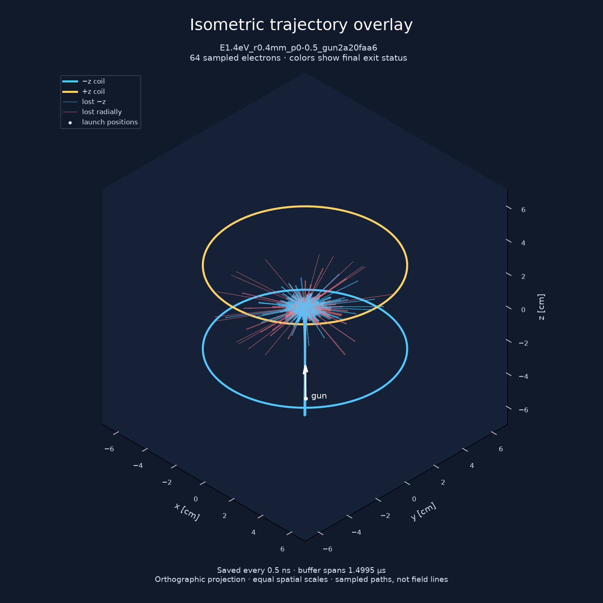

# External gun study: launch angle and resolution

The external gun has not produced useful bulk capture in these configurations.
Tilting the gun produced a few long-lived particles, but that tail disappeared
under timestep and grid refinement. It is not converged confinement evidence.

## Experiment

The gun emits a packet from below the lower coil. Its source has a 50 µm Gaussian
RMS width in each transverse direction. Launch velocities fill a 0–0.5° cone
uniformly in cosine about the aim.

| Parameter | Value |
|---|---|
| Coil radius / half-separation | 5 cm / 2.5 cm |
| Opposed coil currents | 5 kA-turn |
| Source z | −5.5 cm |
| Radial loss boundary / axial boundaries | 4.5 cm / ±6.5 cm |
| Energy | 1.4, 5, 30, 100 eV |
| Particles per member | 200,000 |
| Initial observation window | 20 µs |
| Prescribed charge radius | 1.5 cm |
| Integrator / active precision | Adaptive Boris / FP64 |
| Initial field table | 512 radial × 1024 axial points |

Each energy has a neutral control and a negative prescribed-charge sphere.
The charge sets the source-to-centre potential-energy rise to approximately
95% of the launch kinetic energy. This is a fixed field, not charge deposited
by the simulated electrons.

Run 8 uses source offsets of 0.4 and 2 mm and aim `(0, −0.007142857, 1)`.
Its gun-axis angles to the local magnetic field are only about 0.108° and 1.10°.
Run 9 holds the offset at 0.4 mm and uses aim `(0, −0.5, 0.8660254037844386)`.
Its local-B angle is 29.698°, and the source field is 0.03026 T.

## Initial results

All 3.2 million particles in run 8 escaped before 20 µs. The longest escape time
was 7.974 µs, in the 1.4 eV, 0.4 mm neutral case.

Run 9 had one survivor at 20 µs in each of the 5 and 30 eV charged members.
Each is 1/200,000, or 0.0005%. The other six members had no survivors at 20 µs.
The longest-lived particle in the tilted neutral 1.4 eV member escaped at
9.420 µs; its median escape time was 0.531 µs.

The charged cases generally lose particles faster than the neutral controls.
A rare long tail does not imply improved bulk capture.

Full escape quantiles, loss fractions, and counts at 1, 5, and 20 µs are in
[run 8 metrics](../results/run8_external_gun/metrics.json) and
[run 9 metrics](../results/run9_crossfield_gun/metrics.json).
Counts were checked against every particle's escape channel and escape time.
Step totals were checked against the per-particle counters.

## Resolution check

The two charged cases with survivors are replayed to 100 µs. Each replay uses
the same member tag, random seed, particle count, source, and launch cone.
The four settings are the original grid and gyro fraction, half the gyro
fraction, twice the grid resolution in each direction, and both refinements.

The original gyro fraction is 0.025; the reduced value is 0.0125.
This halves the gyro-based limit, not necessarily every adaptive step.
The finer grid also tightens the cell-crossing timestep cap. This is a
combined spatial/time refinement, not an isolated interpolation experiment.

| Setting | Energy | Survivors at 20 µs | Survivors at 100 µs | Longest escaped time |
|---|---:|---:|---:|---:|
| Baseline | 5 eV | 1 | 1 | 18.327 µs |
| Half gyro fraction | 5 eV | 0 | 0 | 12.238 µs |
| Finer grid | 5 eV | 0 | 0 | 3.877 µs |
| Both refinements | 5 eV | 0 | 0 | 4.116 µs |
| Baseline | 30 eV | 1 | 0 | 28.199 µs |
| Half gyro fraction | 30 eV | 0 | 0 | 0.754 µs |
| Finer grid | 30 eV | 0 | 0 | 2.050 µs |
| Both refinements | 30 eV | 0 | 0 | 8.196 µs |

The 5 eV baseline survivor is censored at 100 µs; the last column excludes it.
All baseline escape times and channels for particles already lost in run 9
reproduced exactly. All eight replays matched the stored initial state of the
first 64 particles and the original seeds.

The original surviving particles, indices 172841 (5 eV) and 146444 (30 eV),
escaped before 0.5 µs in every refined run. Median escape times remain near
0.183 and 0.080 µs. The bulk result is much less sensitive than the rare tail.
Chaotic trajectory sensitivity alone does not establish a specific numerical
artifact, but these results do not support the original tail as robust capture.
The checked outputs are in [run 10](../results/run10_gun_convergence/).

## Interpretation and next useful physics

### Larger-device dwell study

Run 11 scales the coil radius to 25 and 50 cm, with 25 and 50 kA-turn respectively
to preserve the magnetic-field scale. Separation, gun position, source width,
and prescribed-charge radius scale with the device. The gun remains at roughly
30° to local B. Each member uses 200,000 electrons, the 1024 × 2048 field table,
and gyro fraction 0.0125. The windows are 100 µs at 25 cm and 200 µs at 50 cm.

| Radius | Energy | Prescribed field | Mean launch-to-loss dwell (µs) | Survivors |
|---:|---:|---|---:|---:|
| 25 cm | 5 eV | neutral | 2.02184 | 0 |
| 50 cm | 5 eV | neutral | ≥3.70938 | 19 |
| 25 cm | 30 eV | neutral | 0.812087 | 0 |
| 50 cm | 30 eV | neutral | 1.61545 | 0 |
| 25 cm | 5 eV | negative proxy | 0.903719 | 0 |
| 50 cm | 5 eV | negative proxy | 1.80749 | 0 |
| 25 cm | 30 eV | negative proxy | 0.373126 | 0 |
| 50 cm | 30 eV | negative proxy | 0.738036 | 0 |

These are ensemble means including survivors censored at the window, rather
than means over escaped particles alone. Doubling size roughly doubles dwell
in most cases. That largely tracks the increased flight time; it is not by
itself evidence of more bounces. The 19-particle tail needs refinement checks.
The negative prescribed field reduces mean dwell relative to the neutral cases.

At 1 mA, the 50 cm / 5 eV neutral mean implies a fixed-field total inventory
of at least 2.32 × 10¹⁰ electrons (3.71 nC in magnitude). This is a launch-to-loss
inventory, including time outside the useful core. It cannot be converted
directly into a virtual-cathode voltage: that charge would change subsequent
orbits and injection. The core occupancy histogram counts sampling events,
not time-weighted core charge.

Permanent trapping is not required. The next diagnostics should integrate
per-particle time inside a defined core and count core entries/exits and
transits. These distinguish useful repeated residence from simply a longer
path through a larger chamber. Self-consistent deposition and electrode-boundary
Poisson feedback are needed to turn injected current into a well-depth prediction.

The completed broker job is `jonathan-cusp-gun-size-61cc6e`, with output at
`/public/devcontainer-shared/jonathan/cusp/runs/gun-size-20260912-135228`.
Its compact archive is [run 11](../results/run11_gun_size/); the eight complete
browser datasets are in `web/sample-data/`.

These runs test a static two-coil field with a fixed electrostatic proxy.
They do not model a self-consistent negative well or ion loading.
A static electric field can exchange kinetic and potential energy; it does
not remove total energy or supply a dissipative capture mechanism.

The next useful model extension is charge deposited by a physical injected
current, a Poisson solve with electrode boundaries, and an explicit accounting
of injected and escaped charge and energy. A pulsed case also needs the work
done by the applied fields. More particles alone cannot resolve errors in
the fields, boundaries, or integration.

## Trajectory view and diagnostic limits

The view uses equal spatial scales and an orthographic isometric camera.
It shows the first 64 particles, saved every 0.5 ns for about 1.5 µs.
Fast gyration can be undersampled. Colors indicate final loss channels.
The rare survivors are not among these first 64 particles.

Reported energy drift also covers the first 64 particles. It does not bound
the energy error of every particle or certify the rare survivors.

## Reproduction

| Study | Broker job | Output under `/public/jonathan/cusp/runs/` |
|---|---|---|
| Run 8 | `jonathan-cusp-gun-96f329` | `gun-20260912-133459` |
| Run 9 | `jonathan-cusp-gun-crossfield-600b7f` | `gun-crossfield-20260912-134058` |
| Resolution check | `jonathan-cusp-gun-convergence-0f2d71` | `gun-convergence-20260912-134528` |

Each job uses one node, eight B200 GPUs, priority 1, and automatic shutdown.
The job templates are in `jobs/cusp-gun*.yaml`.
Run 8 used the simulator at `b33c897`; the later jobs used `bd6e1e3`, staged
under `src/` on FSx. The source reorganization at `2ae84d2` preserves the
CUDA and numerical code. Compact summaries and selected plots are committed;
the full compressed particle arrays remain in the run directories.
