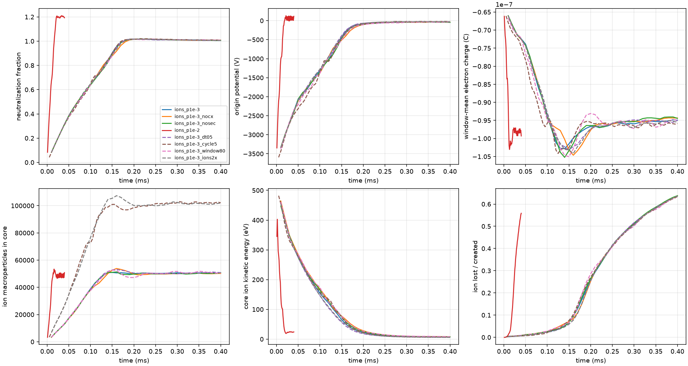
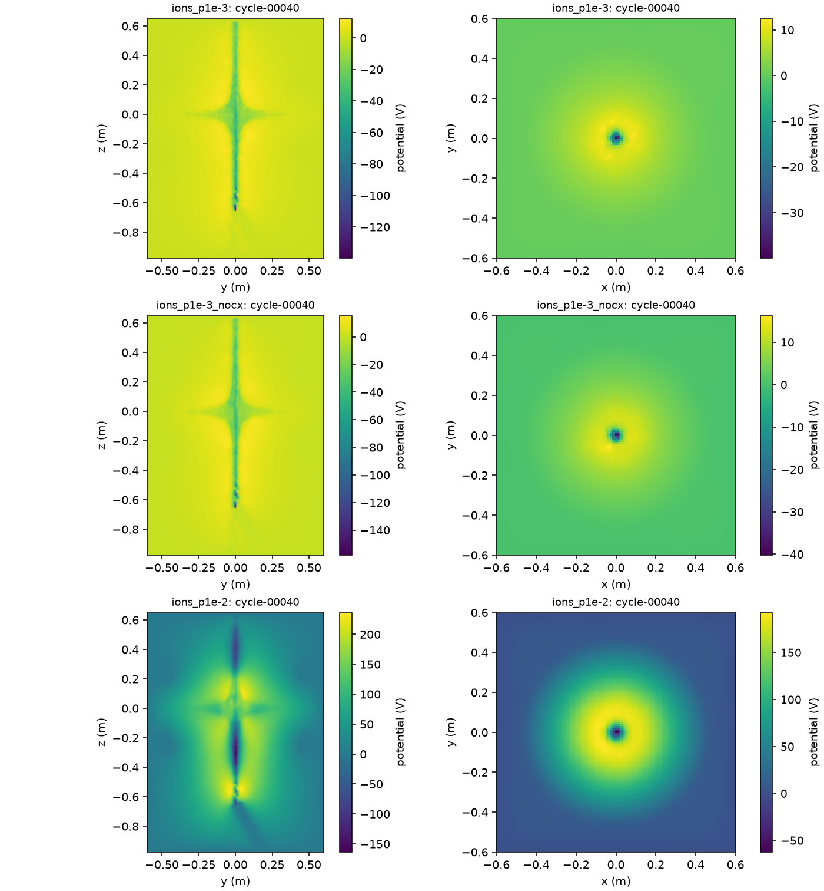

# Coupled electron–ion PIC with gas ionization: design

Scope: the next fidelity step after frozen test ions (`src/ion_orbits.py`). Ions carry charge,
the field is solved from electrons plus ions, and ions are produced by electron-impact
ionization of neutral gas, either a uniform fill or a pumped background plus an inlet plume.
Implemented in `src/ion_pic.py`.

## Why a two-timescale scheme

For the 1 A casing case (`pic_1A_casing_r015`, 300 ns snapshot) the live electron population is
about 4.2e11 electrons with mean kinetic energy 2.8 keV. With a Lotz H2 cross section the
ionization rate scales as 3e14 ions/s at 1e-4 Pa, so the neutralization time
`|Q_e| / (e S)` is about 1.3 ms at 1e-4 Pa and 130 µs at 1e-3 Pa. Electron residence is
about 66 ns and the explicit electron step is 4 ps; an H2+ bounce through a 4 kV well
takes about a microsecond. Explicitly resolving 130 µs of electrons would take ~3e7 steps.

The electron population relaxes in ~1e-7 s, far faster than the ion density changes, so the
coupling is operator-split into cycles:

1. **Electron window** (`--electron-window`, default 40 ns): continue the same external-gun
   electron PIC with the current ion charge as a frozen background. The gun injects at its
   normal rate; secondary electrons from ionization are injected at the current rate. Over the
   second half of the window, average the deposited electron charge and the ionization rate,
   and draw birth positions for new ions weighted by each electron's `n_gas σ(E) |v| w`.
2. **Ion cycle** (`--cycle-duration`, default 10 µs): push ions with an explicit Boris step
   (ion charge-to-mass ratio) in the window-mean electron charge plus the live ion charge,
   re-solved every `--ion-field-every` ion steps with the same conductors and grounded box.
   New ions are created in equal batches across the cycle at the window-mean rate.

The electron window is sub-sampled physical time: electrons are advanced for 40 ns per 10 µs
cycle. This is valid while the ion charge changes by a small fraction per cycle and the
electron population relaxes within the window; the cycle and window lengths are campaign
sensitivity parameters. It is not a resolution of electron–ion instabilities or
of ion-acoustic dynamics faster than the cycle.

## Physics

- Fuel: `--fuel H2` or `D2` (molecular mass 2.016 or 4.028 amu, ionization energy 15.43 or
  15.47 eV). Isotopes share the Lotz form; `--ion-mass-amu` overrides the ion mass.
- Gas: static and not depleted, at `--gas-temperature-k`. The background is
  `(--gas-pa + Q/S) / kT`: residual pressure plus inlet throughput `Q`
  (`--gas-inlet-throughput`, Pa m³/s) over pump speed `S` (`--pump-speed`, m³/s). An inlet at
  `--gas-inlet` adds a free-molecular cosine-law plume `n = (Q/kT) cos θ / (π v̄ r²)`, with
  `v̄ = sqrt(8kT/πm)`, `θ` from `--gas-inlet-direction` (default: toward the origin) and `r`
  clamped to `--gas-inlet-radius`. The plume flux over any enclosing hemisphere equals the
  throughput. It ignores shadowing by the casings and wall reflection.
  In steady state the pumped background `Q/S` usually exceeds the core plume density: a 1 m³/s
  pump and an inlet 0.7 m from the centre give a background ~2000 times the plume at the
  centre. A plume-dominated gas distribution therefore only represents an early-time puff
  (`t < V/S`, before the vessel fills) or strong differential pumping, which the campaign
  approximates with a large `S`. Ionization and charge exchange use the local density.
- Ionization: electron-impact, Lotz form `σ = a q ln(E/P) / (E P)`, `a = 4.5e-18 m² eV²`,
  `q = 2`, `P = 15.43 eV`, scaled by `--ionization-scale`. Within ~10% of measured H2 totals
  at 0.1–1 keV. Primary electrons lose no energy to ionization (~5e-4 events per electron
  lifetime at 1e-3 Pa).
- Ion species: the fuel molecular ion (H2+ or D2+), born with `--ion-temperature-ev`
  Maxwellian velocity. Dissociative ionization and H3+/D3+ formation are omitted.
- Ion gun: `--ion-gun-current` injects the same molecular ion species from `--ion-gun-position`
  along `--ion-gun-direction` (default toward the origin), monoenergetic at `--ion-gun-energy-ev`
  with Gaussian spot `--ion-gun-radius` and RMS divergence `--ion-gun-divergence-deg` per
  transverse axis, in the same batches as ionization ions. The energy is the kinetic energy at
  the emission point, whatever the local potential there. No extraction optics are modelled, so
  place the gun where the potential is near the intended source reference. A D+ beam in a D2 gas
  would need a second species with its own charge-to-mass ratio; it is not implemented.
- Secondary electrons: injected into the electron PIC at the ionization rate from the same
  birth pool, Maxwellian at `--secondary-temperature-ev`; `--no-secondaries` disables them.
  Their population is only captured when their lifetime is short compared with the window.
- Charge exchange: constant cross section `--cx-cross-section` (default 5e-20 m²) against the
  gas; an exchanged ion is replaced by a thermal gas ion at the same position (charge unchanged,
  kinetic energy removed by the fast neutral and counted). No elastic scattering.
- Boundaries: ions are absorbed at the box faces, the gun barrel and the casings, using the
  same endpoint classification as electrons.

## Numerical checks

- Electron window: the existing electron checks (gyration, 0.2-cell drift, omega_p).
- Ions: at least 80 steps per gyration at the table maximum, 0.2-cell drift bound at every
  field update, and `omega_pi dt <= 0.1` from the peak ion nodal charge.
- Accounting: ion created charge = lost + alive; electron charge balance as before; deposited
  ion charge equals live ion charge.

## Not modelled

Collisions between charged particles, ion–ion or electron–ion instabilities faster than the
cycle, gas depletion, neutral transport beyond the free-molecular plume, recombination, wall secondary emission, ion
sputtering, magnetic field from plasma currents, and fusion reactions. The two-coil
axisymmetric field remains imposed.

## Campaign

Eight cases on one node, casing geometry `pic_1A_casing_r015` (1 A, 5 keV, 65-node reference
cells, 1.2a box, 0.06a barrel, 0.15a grounded casings):

| case | change |
|---|---|
| `ions_p1e-3` | 1e-3 Pa, 40 × 10 µs cycles |
| `ions_p1e-3_nocx` | charge exchange off |
| `ions_p1e-3_nosec` | secondary electrons off |
| `ions_p1e-2` | 1e-2 Pa, 40 × 1 µs cycles |
| `ions_p1e-3_dt05` | ion step 0.5 ns |
| `ions_p1e-3_cycle5` | 80 × 5 µs cycles |
| `ions_p1e-3_window80` | 80 ns electron windows |
| `ions_p1e-3_ions2x` | twice the ion macroparticles per cycle |

## Campaign record

**Failed attempt.** Job `jonathan-pic-ed7b7f62b292` at source `06a0f7a`, output
`/public/jonathan/cusp/runs/pic-ed7b7f62b292/attempt-20260913-095532-962632006/`. Preflight
controls passed; seven of eight cases stopped in the first ionization sample with the CUDA
assertion `!(val < zero)` inside `torch.multinomial`, before writing any history. The
secondaries-off case, which samples fewer births, wrote partial cycle history before the job ended.
The Lotz cross section was evaluated on energies clamped to the threshold and then multiplied
by a logarithm that rounds to a tiny negative number just below threshold, so some electrons
contributed negative rates. The output is kept unchanged as evidence.

**Fix.** Source `05e2f69` returns exactly zero below threshold with `torch.where` and rejects
negative rates on the host before sampling. Corrected job `jonathan-pic-267721c0347e`, output
`/public/jonathan/cusp/runs/pic-267721c0347e/attempt-20260913-101913-995265517/`; preflight
passed and all eight cases completed (exit code 0, `DONE` in every case).

## Results

`src/analyze_ion_pic.py`, data `docs/data/pic-ions-05e2f69.json`. 400 µs at 1e-3 Pa and 40 µs at
1e-2 Pa. "Neutralization" is live ion charge over window-mean electron charge in the whole box;
"core" is the 0.125 m sphere. Last-quarter means (cycles 31–40, or 61–80 for `cycle5`); origin
potential is the snapshot potential at the centre. Ion charge balance stayed below 1.1e-19 C.

| Case | Neutralization time | Neutralization | Core neutralization | Origin | Min potential | Core ion KE | Ions lost (final) | Electron charge |
|---|---:|---:|---:|---:|---:|---:|---:|---:|
| `ions_p1e-3` | 147 µs | 1.009 | 0.992 | −38 V | −137 V | 7.8 eV | 64% | −95 nC |
| `ions_p1e-3_nocx` | 147 µs | 1.008 | 0.991 | −41 V | −152 V | 8.7 eV | 64% | −95 nC |
| `ions_p1e-3_nosec` | 147 µs | 1.008 | 0.991 | −39 V | −147 V | 8.0 eV | 64% | −94 nC |
| `ions_p1e-3_dt05` | 147 µs | 1.007 | 0.993 | −31 V | −137 V | 6.7 eV | 64% | −95 nC |
| `ions_p1e-3_cycle5` | 147 µs | 1.010 | 0.993 | −26 V | −116 V | 6.6 eV | 63% | −96 nC |
| `ions_p1e-3_window80` | 147 µs | 1.009 | 0.990 | −39 V | −139 V | 9.1 eV | 64% | −96 nC |
| `ions_p1e-3_ions2x` | 147 µs | 1.007 | 0.993 | −31 V | −137 V | 6.6 eV | 64% | −96 nC |
| `ions_p1e-2` | 14.5 µs | 1.203 | 0.973 | +60 V | −239 V | 23.9 eV | 56% | −98 nC |

Before ions, the same geometry has origin potential −3.97 kV and −66 nC of live electrons.

### Interpretation

- **The electron well does not survive the gas.** Ions accumulate in the well until they cancel
  the electron charge. The origin potential rises from −3.6 kV to about −40 V and the core ion
  energy falls from ~450 eV to ~8 eV. Neutralization time is 147 µs at 1e-3 Pa and 14.5 µs at
  1e-2 Pa, inversely proportional to pressure and within 15% of the 130 µs estimate above.
  Extrapolating, 1e-5 Pa gives ~15 ms. A well used for ion acceleration therefore needs pulses
  shorter than the neutralization time, much lower pressure, or an ion loss or electron supply
  that this model lacks.
- **After neutralization the plasma is quasi-neutral and leaks ions.** Neutralization settles at
  1.01 and ion loss rises from a few percent of created ions at neutralization to 64% by 400 µs. About half the losses go to the gun
  barrel along the beam channel, most of the rest to the top and side faces; no ion reached a
  casing. At 1e-2 Pa the ions overshoot to 1.2, the centre becomes +60 V, and more ions leave
  through the box faces.
- **Neutralization pulls in electrons.** Live electron charge rises 43%, from −66 to −95 nC:
  the ion background lets the beam's own space charge hold more electrons.
- **Splitting and ion numerics are converged for these observables.** Halving the ion step or
  the cycle, doubling the electron window or the ion macroparticles changes neutralization,
  core neutralization, electron charge and loss fraction by at most 1%. The residual origin
  potential varies from −26 to −41 V and core ion energy from 6.6 to 9.1 eV; these are small
  differences between large cancelling charges and should be read as uncertain at the ~10 V and
  ~2 eV level. Turning off charge exchange or secondary electrons changes those quantities by under 1% at
  1e-3 Pa.
- **Missing physics limits the steady state, not the neutralization time.** Neutralization time
  is set by ionization rate and electron inventory. The quasi-neutral state depends on processes
  not modelled: Coulomb collisions, recombination, neutral depletion, wall emission and plasma
  magnetic fields. These results are for the two-coil field with a single beam.
