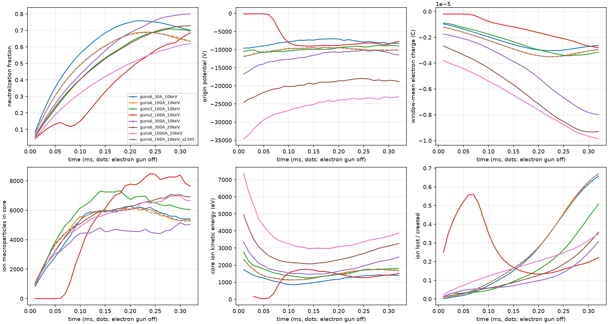
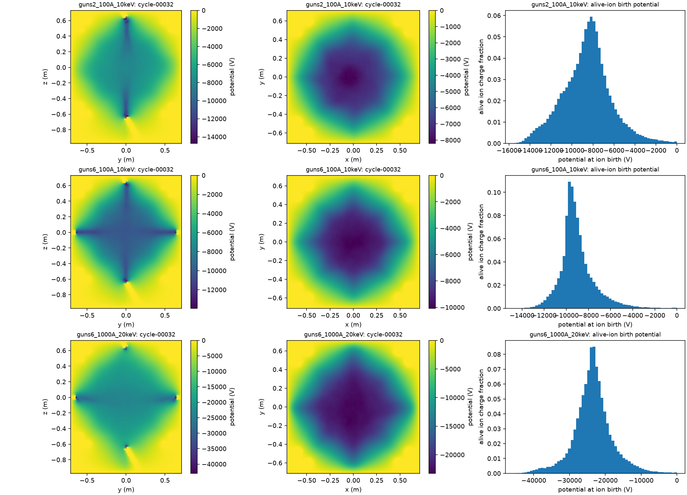

# Multi-gun electron injection (six-coil)

## Motivation

Every high-feed campaign so far uses one electron gun on the −z face axis. At 10 keV, 100 A
builds a −15 to −23 kV virtual cathode at the gun mouth and the beam barely reaches the centre
(`six-coil-feed-fine`). The gun-limit campaign tests energy, divergence and casing bias on that
single gun. The other lever is to split the same total current over several guns so each gun
carries a lower perveance, as practical Polywell designs do with several emitters.

## Geometry

`--guns N` with N in {1, 2, 3, 6} places copies of the existing gun on the six face-axis point
cusps of the six-coil cube, in this order: z−, z+, x−, x+, y−, y+ for N = 2 and 6, and z−, x−, y−
for N = 3. Each copy is the reference gun (emitter at (0, 0.008a, −1.3a), aimed
(0, −sin θ, cos θ)) transformed by a proper rotation of the cube:

| face | map (x, y, z) → |
|---|---|
| z− | (x, y, z) |
| z+ | (x, −y, −z) |
| x− | (z, x, y) |
| x+ | (−z, x, −y) |
| y− | (y, z, x) |
| y+ | (−y, −z, x) |

The six-coil field has this symmetry, so each gun sees the same local field and pitch as the
reference gun. The box is not symmetric (deeper bottom), which is a real difference between faces
and is recorded. With `--gun-radius`, each gun gets its own grounded absorbing barrel, the same
rotated cylinder as the reference barrel. `N > 1` requires `--coils 6`.

## Sampling and accounting

- Particle packets keep `--inject-per-step` macroparticles, which must be divisible by N; each
  packet holds `inject_per_step / N` from every gun, so the total current and the macroparticle
  weight are unchanged and each gun carries `current / N`.
- Gun 0 uses the existing seed stream (`SeedSequence([seed, block])`), so `--guns 1` reproduces
  the current sampler exactly. Gun k > 0 uses `SeedSequence([seed, block, k])`.
- Samples are drawn in the reference frame (including the backwards-velocity check) and then
  rotated, so the emitter spot, thermal spread and divergence are identical for every gun.
- Conductor names become `gun_barrel_<face>` for N > 1 (`gun_barrel` for N = 1); ion and electron
  exit counts therefore separate each barrel. `source_potential_V` stays the z− gun; the
  configuration records every origin, direction and barrel.

## Limits

- Guns are identical and share one current waveform and pulse schedule.
- No new physics: this changes source placement only; the pusher, deposition and field solves are
  untouched.
- Six guns on face cusps is one design choice; corner-cusp or off-axis emitters are not covered.
- The mesh spacing is coarser along z than across it, so the x and y barrels resolve onto fewer
  conductor nodes than the z barrels; `gun_barrels[].nodes` records the counts.

## Campaign `six-coil-multi-gun`

Coupled electron and H2+ PIC, 30 kA-turn, H2 at 1e-3 Pa, 32 × 10 µs cycles, 12 macroparticles per
packet, 0.5 ns ion steps unless noted. Compared against the one-gun `feed_*_p1e-3` and
`limit_*` cases.

| case | guns | total current | energy | notes |
|---|---|---|---|---|
| guns6_30A_10keV | 6 | 30 A | 10 keV | vs one-gun 30 A |
| guns6_100A_10keV | 6 | 100 A | 10 keV | vs one-gun 100 A choke |
| guns6_100A_10keV_s2345 | 6 | 100 A | 10 keV | second seed |
| guns3_100A_10keV | 3 | 100 A | 10 keV | |
| guns2_100A_10keV | 2 | 100 A | 10 keV | |
| guns6_300A_10keV | 6 | 300 A | 10 keV | 0.2 ns ion steps |
| guns6_300A_20keV | 6 | 300 A | 20 keV | 0.2 ns ion steps |
| guns6_1000A_20keV | 6 | 1000 A | 20 keV | 0.2 ns ion steps |

At the highest feeds the electron Debye length can fall below the mesh spacing; those cases need a
refinement check before their well depth is trusted.

### Results (job `jonathan-pic-3bc45c365768`, source `65c6bd2`)

All eight cases have `DONE`, 32/32 cycles, finite records and ion charge balance ≤ 2.3e-18 C.
Raw output: `/public/jonathan/cusp/runs/pic-3bc45c365768/attempt-20260914-002200-700331109`.
Summary: `docs/data/pic-six-coil-multi-gun-65c6bd2.json`. Last-quarter means ± half-range. "Source" is
the potential at the z− gun mouth. Exits split lost ions between box walls, gun barrels and coil
casings. "Status" is the final-quarter drift test (neutralization within 0.02 and centre within 5% or
100 V).

| Case | Per-gun perveance | Neutralization | Origin | Domain minimum | Source | Electron charge | Core ion KE | Exits wall/barrel/casing | Status |
|---|---:|---:|---:|---:|---:|---:|---:|---|---|
| `feed_30A_10keV_p1e-3` (1 gun) | 3.0e-5 | 0.707 ± 0.033 | −5.7 kV | −11.3 kV | | −2080 nC | 1137 eV | | drifting |
| `feed_100A_10keV_p1e-3` (1 gun) | 1.0e-4 | 0.111 | −0.1 kV | −23.2 kV | | −151 nC | 100 eV | | choked |
| `guns6_30A_10keV` | 5.0e-6 | 0.727 ± 0.024 | −8.07 ± 0.28 kV | −9.4 kV | −1.7 kV | −2795 nC | 1403 eV | 0.74/0.03/0.22 | drifting |
| `guns2_100A_10keV` | 5.0e-5 | 0.630 ± 0.054 | −8.23 ± 0.47 kV | −14.4 kV | −7.6 kV | −2479 nC | 1376 eV | 0.30/0.60/0.10 | drifting |
| `guns3_100A_10keV` | 3.3e-5 | 0.702 ± 0.010 | −9.00 ± 0.23 kV | −15.8 kV | −6.3 kV | −3325 nC | 1767 eV | 0.69/0.07/0.24 | settled |
| `guns6_100A_10keV` | 1.7e-5 | 0.660 ± 0.026 | −10.13 ± 0.18 kV | −14.1 kV | −4.3 kV | −3170 nC | 1720 eV | 0.70/0.05/0.25 | drifting |
| `guns6_100A_10keV_s2345` | 1.7e-5 | 0.663 ± 0.025 | −10.17 ± 0.22 kV | −14.1 kV | −4.3 kV | −3189 nC | 1731 eV | 0.70/0.05/0.25 | drifting |
| `guns6_300A_10keV` | 5.0e-5 | 0.786 ± 0.019 | −10.64 ± 0.67 kV | −18.1 kV | −8.0 kV | −7461 nC | 2221 eV | 0.59/0.16/0.25 | drifting |
| `guns6_300A_20keV` | 1.8e-5 | 0.716 ± 0.017 | −18.43 ± 0.44 kV | −26.9 kV | −9.1 kV | −9079 nC | 2996 eV | 0.60/0.08/0.32 | drifting |
| `guns6_1000A_20keV` | 5.9e-5 | 0.595 ± 0.027 | −23.30 ± 0.36 kV | −42.9 kV | −17.7 kV | −9408 nC | 3607 eV | 0.45/0.28/0.27 | drifting |

### Interpretation

- **Sharing the current removes the single-gun choke.** At 100 A and 10 keV one gun leaves the centre
  at −0.1 kV; two guns give −8.2 kV, three −9.0 kV and six −10.1 kV. The second seed agrees within
  0.4% in potential and 0.003 in neutralization.
- **Two guns sit at the edge of the choke.** `guns2_100A_10keV` stays choked for ~60 µs until ions
  born at the mouths cancel the barrier, and 60% of lost ions still leave through the barrels. Three
  and six guns send only 5–7% of lost ions into the barrels.
- **The well becomes a volume, not a channel.** With six guns the potential in the x–y plane is a
  broad −10 kV region filling the coil interior; with one gun it was a beam channel with a small
  central blob.
- **Well depth follows gun energy more than current.** Six guns at 10 keV give −8.1, −10.1 and
  −10.6 kV at 30, 100 and 300 A. At 20 keV, 300 A gives −18.4 kV and 1000 A −23.3 kV with 3.6 keV
  core ions. The centre stays at roughly 0.8–1.2 of the gun energy in kV.
- **Neutralization is not driven down by current.** Every case sits at 0.60–0.79 at 1e-3 Pa; the ion
  inventory grows with the electron inventory.
- **Only `guns3_100A_10keV` passes the drift test.** Neutralization in the six-gun 100 A cases is
  still falling (0.05 over the last quarter), and the 300 A and 1000 A electron inventories are still
  growing. These are 320 µs transients, not plateaus.
- **Limits.** The 1000 A mouth minimum (−43 kV) sits in a few cells near the barrels and needs the
  49-node mesh comparison. All cases use 10 µs ion cycles, which the `sustain_10A_10keV_cycle5` control
  showed is not converged, so neutralization and depth are provisional until `six-coil-splitting`
  finishes. The field is the vacuum coil field.

## Campaign `six-coil-multi-gun-check`

Job `jonathan-pic-3228957e6203`, source `b6ba5d6`, submitted while `six-coil-multi-gun` was at
cycles 8–17. Mid-run histories showed the multi-gun wells reaching −7 to −28 kV at the origin, but
with only 18k–240k live electron macroparticles (378 in the core at 1000 A), so particle noise and
mesh resolution both need checking before the depths are used. Each case reuses its base case's
guns, current, energy, seed and ion step.

| case | base | change |
|---|---|---|
| guns6_100A_10keV_n97 | guns6_100A_10keV | 97-node mesh, 16 cycles |
| guns6_1000A_20keV_n97 | guns6_1000A_20keV | 97-node mesh, 16 cycles |
| guns6_100A_10keV_ppc4 | guns6_100A_10keV | 48 macroparticles per packet, 16 cycles |
| guns6_1000A_20keV_ppc4 | guns6_1000A_20keV | 48 macroparticles per packet, 16 cycles |
| guns6_100A_10keV_cycle5 | guns6_100A_10keV | 5 µs cycles, 64 cycles |
| guns6_100A_10keV_p1e-4 | guns6_100A_10keV | 1e-4 Pa, 16 × 100 µs cycles |
| guns6_1000A_20keV_p1e-4 | guns6_1000A_20keV | 1e-4 Pa, 8 × 100 µs cycles |
| guns6_100A_10keV_60kAt | guns6_100A_10keV | 60 kA-turn coils |

Comparisons use the base case's history at the same simulated time, since the 16-cycle checks stop
halfway through the base run.

Three cases failed at startup and produced no data:

- **n97 (both):** CUDA out of memory building the conductor capacitance matrix. The 97-node mesh has
  139k held conductor surface nodes, so one dense FP64 copy is 117 GiB and the Cholesky inverse needs
  three. Probing the next valid finer mesh (81 nodes, 87k surface nodes, 56 GiB per copy) also rules it
  out: cuSOLVER `potrf` fails with `CUSOLVER_STATUS_INTERNAL_ERROR` above ~65.5k rows (65,000 passes,
  66,000 fails), which reads as a 2^32-element internal limit. Mesh sizes must keep whole reference cells
  (nodes − 1 a multiple of 16: 49, 65, 81, 97), so 65 nodes is the finest mesh the dense conductor
  path supports. Refining further needs a factorization that is blocked or matrix-free.
- **60kAt:** `Timestep requires at least 80 steps per gyration`. The 2 ps electron step gives
  \|q/m\| B_max dt = 0.114 at 60 kA-turn against a limit of 2π/80 = 0.0785.

## Campaign `six-coil-multi-gun-scale`

Replaces the failed check cases and extends the feed. Six guns, H2 at 1e-3 Pa, 10 µs cycles, 12
macroparticles per packet.

| case | current | energy | change |
|---|---|---|---|
| guns6_100A_10keV_n49 | 100 A | 10 keV | 49-node mesh (coarser), 16 cycles |
| guns6_1000A_20keV_n49 | 1000 A | 20 keV | 49-node mesh, 16 cycles |
| guns6_3000A_20keV_n49 | 3000 A | 20 keV | 49-node mesh, 0.1 ns ion step, 16 cycles |
| guns6_100A_10keV_60kAt | 100 A | 10 keV | 60 kA-turn, 1 ps electron step, 16 cycles |
| guns6_1000A_20keV_60kAt | 1000 A | 20 keV | 60 kA-turn, 1 ps electron step, 16 cycles |
| guns6_1000A_20keV_s2345 | 1000 A | 20 keV | second seed, 32 cycles |
| guns6_100A_20keV | 100 A | 20 keV | energy at matched current, 32 cycles |
| guns6_3000A_20keV | 3000 A | 20 keV | 0.1 ns ion step, 16 cycles |

The mesh check coarsens rather than refines: the 49 → 65 change bounds the 65-node discretization error
only if the trend is monotone, and it is weaker evidence than a finer mesh. The 1 ps runs keep 4 ps
packets, so injected current is unchanged. At 3000 A each gun carries 500 A at 20 keV, 1.8e-4 A/V^1.5,
above the single-gun choke estimate of ~1e-4; that tests whether six guns hold off the choke at the
same per-gun perveance.
