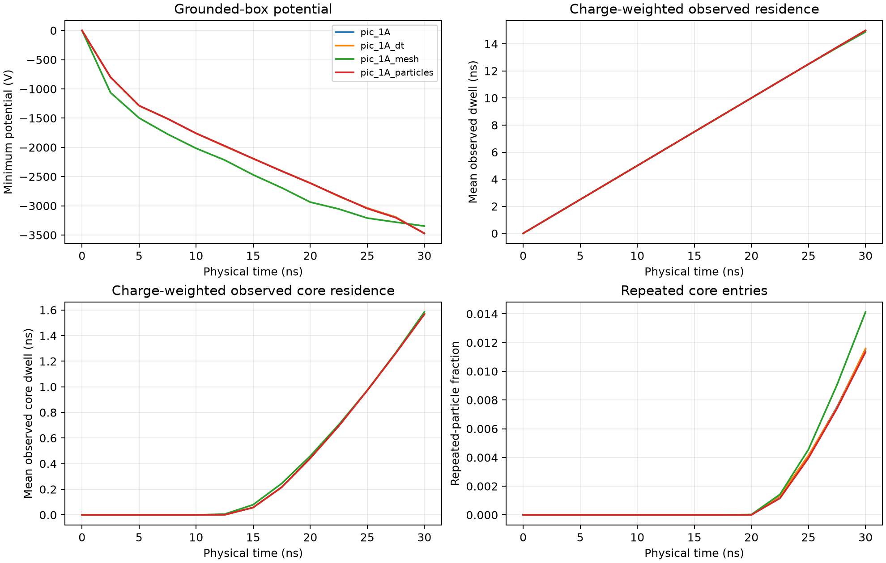
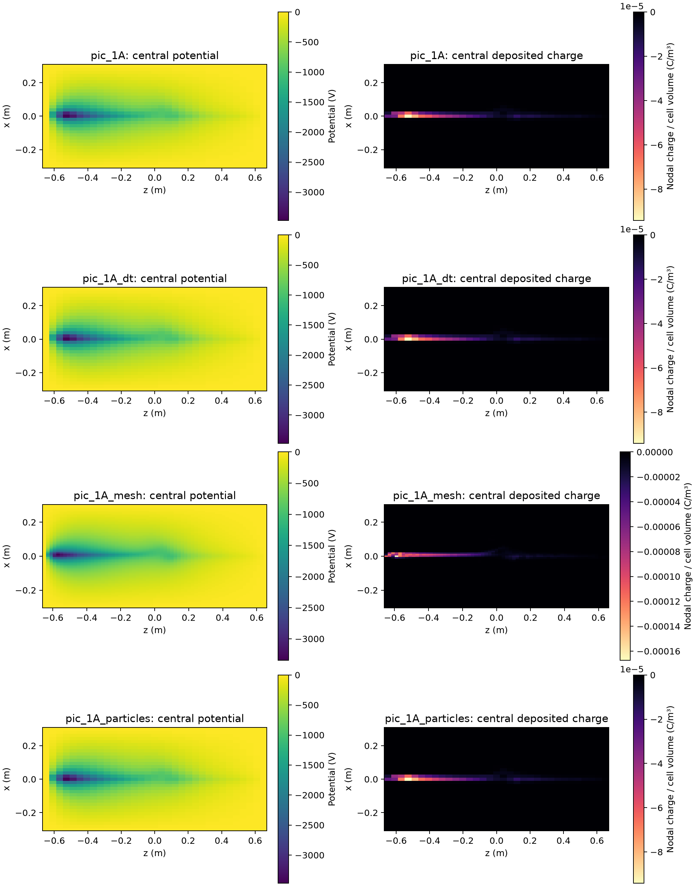

# PIC refinement: mesh and inlet losses need more work

The matched-packet timestep comparison is much closer than the earlier startup
comparison. Refining the mesh changes the dominant loss channel, so the electron
well and capture efficiency are **not spatially converged**.

## Experiment

Broker job `jonathan-pic-faddfbad8a8f-b5e845` completed all four cases at 30 ns,
using immutable source `23881f744456da118a9865f4aa1575c0a42f6e7a`.
Each case used one B200 on the same node, priority 1, with automatic shutdown.
The backend was the FP64 Torch reference throughout.

All cases use 1 A, 5 keV, 50 µm transverse RMS source size, 10° angular spread,
the same source seed, and one physical injection packet every 4 ps. The imposed
field comes from two opposing 30 kA-turn circular coils of radius 0.5 m.
The gun starts at `(0, 0.004, −0.65)` m, aimed 30° off the +z axis; its nominal
pitch to local B is 29.65°. This is an axisymmetric two-coil cusp, not a six-coil
Polywell.

| Case | Timestep | Mesh | Particles/packet | Injected particles |
|---|---:|---:|---:|---:|
| Baseline | 4 ps | 33³ | 8 | 60,000 |
| Half timestep | 2 ps | 33³ | 8, every second step | 60,000 |
| Finer mesh | 4 ps | 65³ | 8 | 60,000 |
| More particles | 4 ps | 33³ | 16 | 120,000 |

Every case represents the same injected charge, −30 nC. Doubling the particles
halves their weights; it also changes the Monte Carlo sample. One realization
per setting cannot establish sampling convergence.

## Final observations

| Case | Global minimum (V) | Potential at center (V) | Observed core dwell (ns) | Lost fraction | Entrance / opposite-end losses |
|---|---:|---:|---:|---:|---:|
| Baseline | −3471.634 | −967.604 | 1.571694 | 0.7800% | 0 / 468 |
| Half timestep | −3471.618 | −967.720 | 1.571630 | 0.7783% | 0 / 467 |
| Finer mesh | −3346.729 | −913.066 | 1.584399 | 4.2033% | 2243 / 279 |
| More particles | −3470.706 | −963.907 | 1.565760 | 0.7733% | 0 / 928 |

There were no x- or y-wall losses. The finest mesh moves the potential minimum
from `(0, 0, −0.528125)` m to `(0.009375, 0, −0.56875)` m, nearer the inlet.
It also produces 2,243 returns through the entrance where the coarse mesh has
none. This is a material change in the result, even though the minimum potential
changes by only 3.73% when normalized to the finer value.

With matched source packets, halving the timestep changes the minimum potential
by just 0.0158 V and the observed core dwell by 0.00405%. The earlier startup
comparison changed packet cadence as well as timestep; it should not be used
as a pure timestep error estimate.

The doubled-particle case changes minimum potential by 0.928 V and observed core
dwell by 0.379%. Those are promising sensitivity results for this coarse mesh,
not a convergence certificate.





The field plots use independently scaled color bars. The deepest potential
remains near the gun rather than at the imposed magnetic null.

## Accounting and limitations

All 52 saved states passed step/time matching, finite particle/field checks,
unique live IDs, particle-count accounting, and agreement between deposited
charge, particle weights and recorded live charge. Final charge residuals are
about 4×10⁻²¹ C; deposition residuals are about 10⁻²³ C.

The final open energy residual divided by injected kinetic energy is
5.61×10⁻⁶, 3.62×10⁻⁶, 3.11×10⁻⁶ and 1.40×10⁻⁶ respectively. This checks the
implemented accounting; it is not a gun/electrode power budget.

Mean observed total dwell is about 15 ns, close to the mean age of a continuously
injected population over this 30 ns window. It is right-censored, not an
uncensored electron lifetime. Observed core dwell is normalized by all injected
represented electrons, including those that have not reached the core.

Both meshes leave the 50 µm emitter unresolved. Transverse cell widths are
18.75 mm and 9.375 mm; axial widths are 40.625 mm and 20.3125 mm. The source
is injected at a grounded, absorbing boundary. Charge assigned by CIC to
boundary nodes is tracked separately; it changes with mesh spacing and source
position. There are no explicit extraction electrodes or filament sheath.

## Next experiments

1. Resolve the CUDA arithmetic discrepancy and repeat the unchanged long-run
   external-gun checks before using CUDA for physical comparisons.
2. Refine mesh and inlet treatment together in a controlled study: hold the
   physical gun and coils fixed, test mesh alignment, and independently vary
   outer boundary extent. Represent extraction electrodes before interpreting
   the inlet charge concentration as a device well.
3. Repeat multiple source seeds and longer physical windows after the boundary
   study. Track entrance losses and central potential, not only the global
   potential minimum. Keep timestep, source cadence and physical current fixed.
4. Add six-coil geometry and test-ion diagnostics only after the electron model
   passes these controls. Ion space charge, collisions and electromagnetic
   feedback are additional milestones; Helion-like dynamics require them.

No stable-well, confinement, Polywell-performance or Helion-performance claim
follows from these runs.

Reproduction:

```bash
OMP_NUM_THREADS=1 PYTHONPATH=src python3 src/analyze_pic_startup.py \
  --run <completed-refinement-attempt> --out <new-analysis-directory> \
  --study refinement
```
