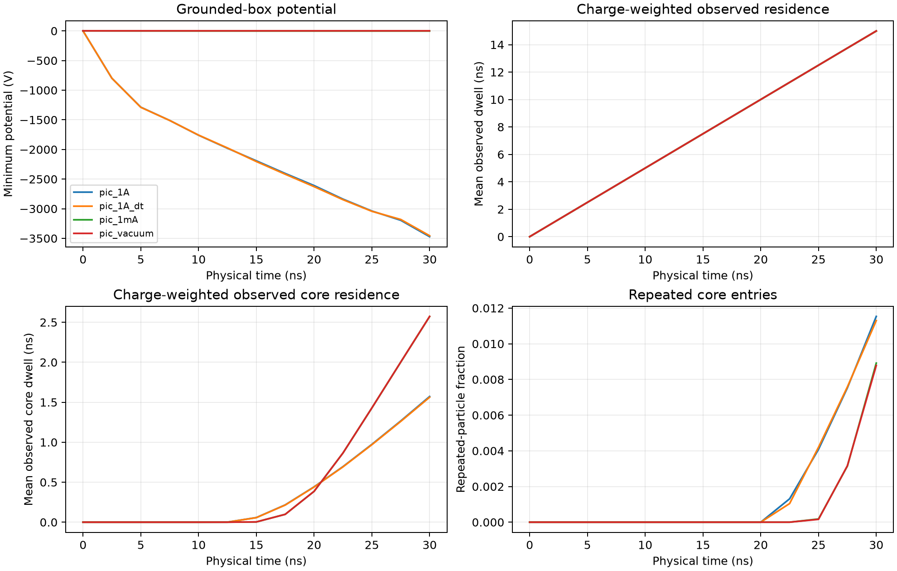
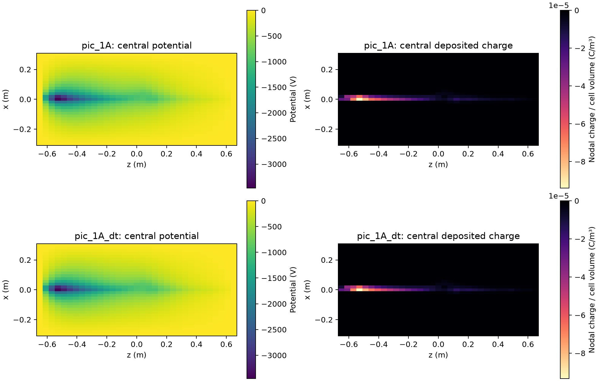

# 30 ns transient PIC startup evidence

The first bounded transient campaign advanced continuously injected 5 keV
electrons for 30 ns on a 33³ grounded-box mesh. Six 30 kA-turn imposed coils
produce a magnetic null at the box center. The source is a 50 µm Gaussian
post-extraction inlet with 10° divergence and a 30° aim.

This campaign tests startup accounting and basic timestep sensitivity. It does
not establish a converged virtual cathode or predict a Polywell device.

## Final state

| Case | Minimum potential | Observed core dwell | Repeated-entry particles | Loss |
|---|---:|---:|---:|---:|
| Vacuum control | 0 V | 2.573 ns | 0.878% | 0% |
| 1 mA | −2.12 V | 2.572 ns | 0.892% | 0% |
| 1 A, 4 ps | −3.472 kV | 1.572 ns | 1.153% | 0.780% |
| 1 A, 2 ps | −3.455 kV | 1.562 ns | 1.130% | 0.800% |

Observed dwell divides accumulated residence by all represented electrons
injected through the current time. It is right-censored by the 30 ns window.

At 1 A, the self-deposited electron charge produced a strong negative
electrostatic structure. Its minimum was at \(z=-0.528125\) m, near the inlet.
The potential at the magnetic null was −968 V. The deepest potential is
therefore an inlet charge concentration rather than a central virtual cathode.

The 1 A case reduced core-entry events from 0.459 to 0.305 per injected
particle and reduced observed core dwell by 39% relative to vacuum. It increased
the repeated-entry fraction by 31%. The space charge reflects a subset of
electrons repeatedly, but it also makes the core less accessible.

All 468 losses in the 4 ps case exited through the opposite \(z\) face. Losses
began after 25 ns. The short window does not measure the final residence-time
distribution or a steady injection-loss balance.

## Numerical evidence

The 2 ps result changed the following final values relative to the 4 ps result:

- minimum potential: 0.475%
- field energy: 0.135%
- observed core dwell: 0.590%
- core-entry events per injected particle: 0.109%
- repeated-entry fraction: 2.06%
- core electron inventory: 0.752%

The two cases changed packet cadence and source samples, so these differences
combine integration and sampling effects. The updated campaign keeps packet
times, samples, represented charge and particle count fixed when the timestep
is halved.

The 4 ps run closed injected, lost and live charge to \(4.0\times10^{-21}\) C.
Its deposited mesh charge differed from live charge by
\(1.7\times10^{-23}\) C. Its open energy residual was 5.61 parts per million of
injected kinetic energy. The 2 ps residual was −1.91 parts per million.

## Limits and next controls

The 50 µm source is far smaller than the 18.75 mm transverse and 40.625 mm
axial mesh spacing. The mesh can represent total deposited charge and a
subcell particle position, but it cannot resolve the source sheath or gun
electrodes. The next physical interpretation should use the center and
core-potential profile rather than the global minimum near the inlet.

The next bounded controls are:

1. Pass the CUDA operators against the FP64 reference for identical external-gun
   packets and report operator and whole-step timings.
2. Repeat the 4 ps and 2 ps cases with identical packet cadence.
3. Vary mesh, particle count, box size and observation window independently.
4. Add explicit gun and electrode boundary geometry before treating the inlet
   potential as physical.
5. Add test ions only after the central electron potential and dwell metrics
   stabilize across those controls.

Ions, collisions, ionization, neutral gas, conductor geometry and
plasma-generated magnetic fields remain absent. Helion-like FRC behavior also
requires electromagnetic and ion physics outside this electrostatic cusp model.
