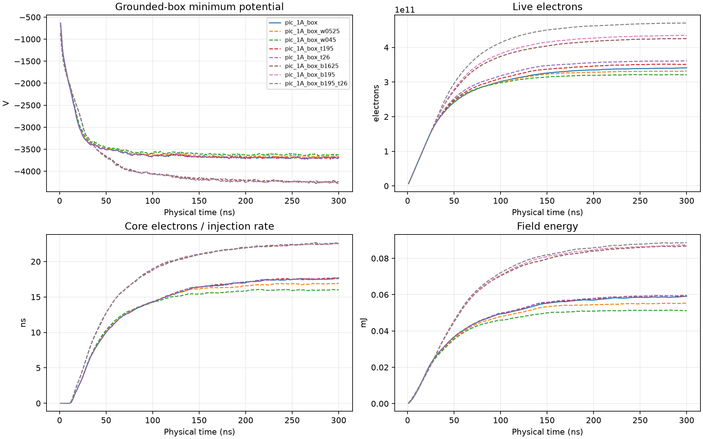
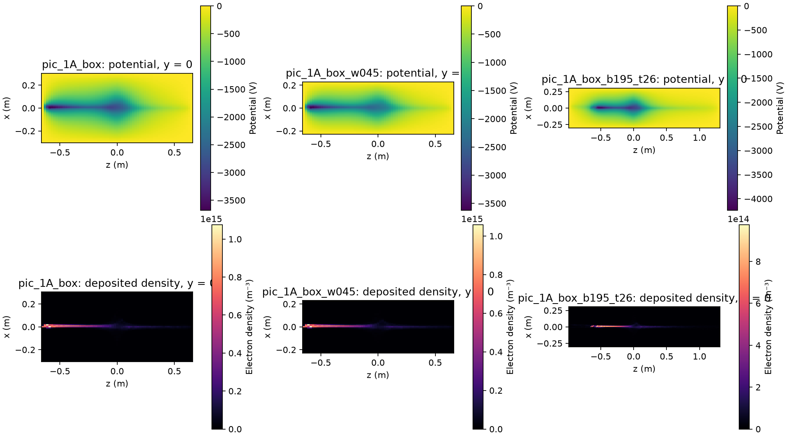
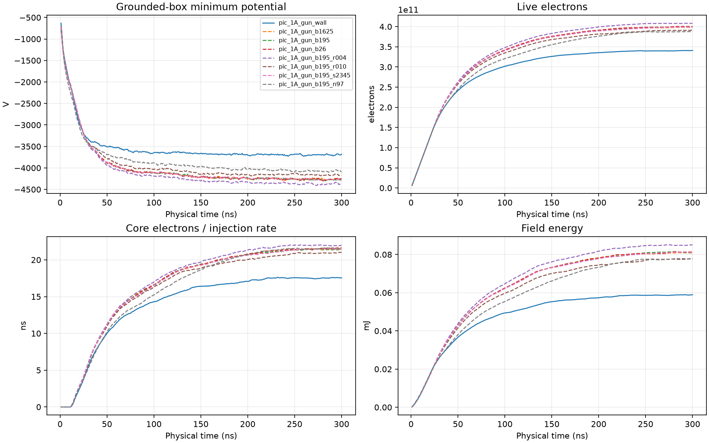
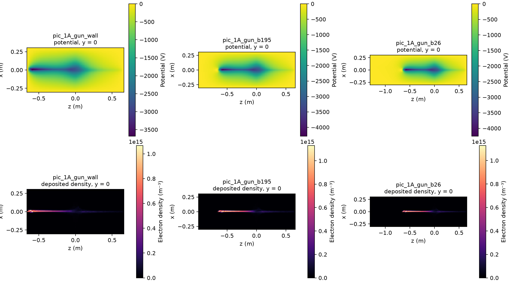
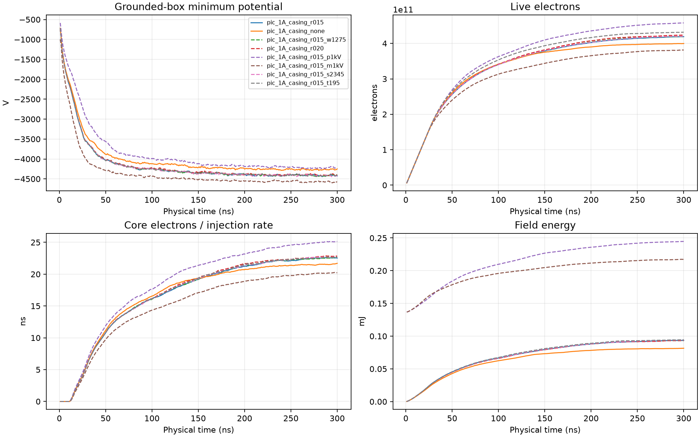
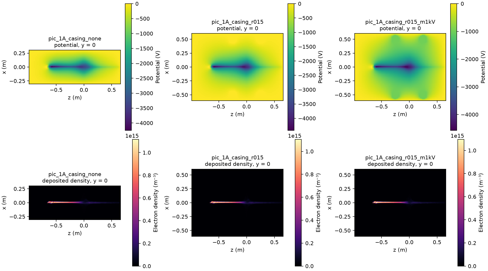
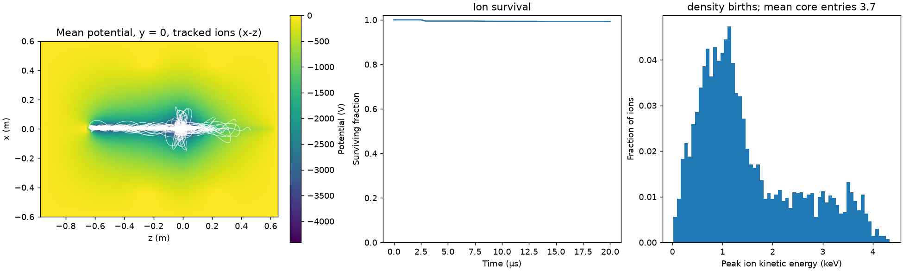
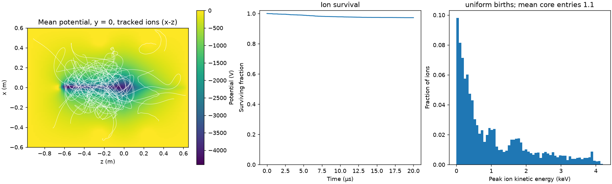

# PIC long window: 300 ns sensitivity study

At 1 A the electron population reaches a quasi-steady state by ~200 ns. In the
200–300 ns window, particle count, timestep and seed each change the window
means by less than 0.6% at 65³. Mesh resolution still changes the minimum
potential by up to 12% and field energy by up to 18%, so the **well depth is not
mesh-converged**. The deepest potential sits near the inlet, not at the center.
This is sensitivity evidence, not a convergence certificate.

## Experiment

Broker job `jonathan-pic-2458a54ed3ff-7fc4f1`, immutable source
`12aac947b4ae6f4b76dcace84e0eee30f61dcff1`, one B200 node, priority 1, automatic
shutdown. Eight CUDA cases ran concurrently, one per GPU.

Common settings: time-dependent electron-only PIC, 1 A external compact gun,
5 keV, 50 µm transverse RMS source, 10° angular spread, gun at
`(0, 0.004, −0.65)` m aimed 30° off +z. Two opposing 30 kA-turn circular
coils of radius 0.5 m (axisymmetric cusp, not a six-coil Polywell). Grounded
rectangular box `±0.3 × ±0.3 × ±0.65` m with absorbing walls; the gun sits on the
`z = −0.65` m face; nominal pitch to local B 29.65°. Core radius 0.125 m. Duration 300 ns; scalar diagnostics every 1 ns.

| Case | Mesh | Timestep | Particles/packet |
|---|---:|---:|---:|
| `n33` … `n129` | 33³, 49³, 65³, 97³, 129³ | 4 ps | 8 per step |
| `n65_particles` | 65³ | 4 ps | 16 per step |
| `n65_dt` | 65³ | 2 ps | 8 every second step |
| `n65_s2345` | 65³, seed 2345 | 4 ps | 8 per step |

Every case injects the same −300 nC. Artifacts:

```text
/public/jonathan/cusp/runs/pic-2458a54ed3ff/attempt-20260913-073830-155476715/
```

Analysis: `src/analyze_pic_window.py`, output in `docs/data/pic-window-12aac94.json`.

## Window means, 200–300 ns

"Residence" is live charge divided by injection rate; it equals mean dwell only
in a stationary state. Loss, entry and exit numbers are final values at 300 ns,
per injected particle, except inlet-face exits, which are a fraction of lost
particles.

| Case | Min potential (V) | Field energy (mJ) | Core residence (ns) | Residence (ns) | Lost | Core entries | ≥2 entries | Inlet-face exits |
|---|---:|---:|---:|---:|---:|---:|---:|---:|
| n33 | −3756 | 59.3 | 17.35 | 56.0 | 81.2% | 0.859 | 18.9% | 64.9% |
| n49 | −3718 | 56.4 | 16.47 | 53.4 | 82.1% | 0.831 | 17.7% | 68.8% |
| n65 | −3693 | 58.7 | 17.52 | 54.4 | 81.8% | 0.839 | 18.4% | 68.9% |
| n97 | −3517 | 53.9 | 16.71 | 52.5 | 82.3% | 0.822 | 17.3% | 65.9% |
| n129 | −3341 | 50.4 | 16.09 | 50.9 | 82.9% | 0.806 | 17.1% | 67.5% |
| n65, 2× particles | −3696 | 58.5 | 17.46 | 54.4 | 81.8% | 0.839 | 18.5% | 68.9% |
| n65, ½ dt | −3694 | 58.5 | 17.43 | 54.3 | 81.9% | 0.837 | 18.4% | 68.9% |
| n65, seed 2345 | −3693 | 58.6 | 17.48 | 54.4 | 81.8% | 0.840 | 18.5% | 68.9% |

Within the window, the relative standard deviation of every tracked mean is
below 1.4% and the largest drift is 4.6% per 100 ns (field energy, 97³), so the
state is close to, but not exactly, stationary.

Relative to 129³:

| Mesh | Min potential deeper by | Field energy higher by | Core electrons higher by |
|---|---:|---:|---:|
| 33³ | 12.4% | 17.6% | 7.9% |
| 49³ | 11.3% | 12.1% | 2.4% |
| 65³ | 10.6% | 16.4% | 8.9% |
| 97³ | 5.3% | 7.1% | 3.9% |

Relative to 65³ seed 1234, the 2× particle, ½ dt and alternate-seed variants
differ by at most 0.37%, 0.51% and 0.26% across the same metrics.


## Fields at 300 ns


| Case | Global minimum position (m) | Center potential (V) |
|---|---|---:|
| n33 | (0, 0, −0.569) | −2775 |
| n65 | (0.009, 0, −0.569) | −2725 |
| n97 | (0.006, 0, −0.582) | −2723 |
| n129 | (0.009, 0, −0.569) | −2629 |

The deepest potential is ~8 cm inside the inlet face, where the injected beam
is densest. A second, shallower negative region surrounds the cusp center. This
is a negative electron potential; it is not a validated positive-ion well, and
no ions are simulated.

## Accounting

Charge balance stayed within 8.3e−19 C (injected charge 3e−7 C) and deposition
error within 5.3e−23 C in every case.

## Interpretation

- Sampling noise and timestep error are not limiting at 65³ over 300 ns.
- Mesh resolution is limiting. The minimum potential converges slowly and
  monotonically shallower with refinement, consistent with an under-resolved
  compact beam near the inlet: the 50 µm source is unresolved on every mesh
  (129³ cells are 4.7 mm × 4.7 mm × 10.2 mm).
- About two thirds of lost particles leave through the inlet face (~55% of
  injected particles); ~18% of injected particles enter the core at least twice.
- The grounded box and its proximity to the inlet likely shape the inlet
  minimum. Box-size sensitivity and credible gun/electrode boundaries are the
  next checks before interpreting well depth.

## Timing

Mean wall time per step under eight concurrent processes was 4.1–4.3 ms at 4 ps
and 3.0 ms for the ½ dt case, which injects every second step. The isolated
single-GPU profile at ~60k live particles measured 2.24 ms per step. The
difference between concurrent long-window and isolated profile timings is being
measured separately (see `docs/pic-cuda-evidence.md`).

## Grounded-box sensitivity

`run_pic_campaign.py --study domain` repeats the 65³ long-window case (1 A,
5 keV, 30 kA-turn, seed 1234, 4 ps, 300 ns, CUDA) in eight grounded boxes.
`--box-half-width`, `--box-bottom` and `--box-top` are in coil radii; node
counts scale so every case keeps the 65³ reference cells (9.4 mm transverse,
20.3 mm axial) and a node at the origin, and the magnetic lookup table is
extended to cover the box. Defaults reproduce the reference mesh and table
bitwise.

| Case | Half-width | Bottom | Top | Nodes |
|---|---:|---:|---:|---|
| `pic_1A_box` | 0.6 | 1.3 | 1.3 | 65×65×65 |
| `pic_1A_box_w0525` | 0.525 | 1.3 | 1.3 | 57×57×65 |
| `pic_1A_box_w045` | 0.45 | 1.3 | 1.3 | 49×49×65 |
| `pic_1A_box_t195` | 0.6 | 1.3 | 1.95 | 65×65×81 |
| `pic_1A_box_t26` | 0.6 | 1.3 | 2.6 | 65×65×97 |
| `pic_1A_box_b1625` | 0.6 | 1.625 | 1.3 | 65×65×73 |
| `pic_1A_box_b195` | 0.6 | 1.95 | 1.3 | 65×65×81 |
| `pic_1A_box_b195_t26` | 0.6 | 1.95 | 2.6 | 65×65×113 |

The gun stays at z = −1.3a with the same aim and local-B angle in every case.
Two geometric constraints shape the matrix:

- Transverse walls only move inward. The coil windings sit at r = a, outside
  the reference box; a wider box would place mesh nodes next to the windings,
  where the sampled field exceeds the 80-steps-per-gyration timestep guard.
- Moving the bottom wall down leaves the gun inside the grounded volume instead
  of on its wall, so the bottom-wall cases change what the gun sees as well as
  the image-charge distance.

`analyze_pic_window.py --study domain` reports window means relative to the
reference box, the final-snapshot potential at the origin, the minimum inside
the core sphere and the global minimum with their positions. This is a
sensitivity check with one seed per box, not a convergence certificate.

### Results

Job `jonathan-pic-4af1720882ba-488610` at source `1a9dab6`: all eight cases
wrote `DONE` with exit code 0 in about seven minutes on one B200 node. Window
means cover 200–300 ns. Final fields are the 300 ns snapshot.

| Case | Window min φ | Field energy | Core residence | Loss | ≥2 core entries | Inlet-face share of losses | φ at origin | Core min φ | φ at gun |
|---|---:|---:|---:|---:|---:|---:|---:|---:|---:|
| reference | −3692 V | 58.3 µJ | 17.4 ns | 0.818 | 0.185 | 0.69 | −2758 V | −2921 V | 0 V |
| width 0.525 | −3661 V | 55.0 µJ | 16.8 ns | 0.823 | 0.185 | 0.67 | −2525 V | −2698 V | 0 V |
| width 0.45 | −3623 V | 51.3 µJ | 16.0 ns | 0.828 | 0.182 | 0.65 | −2277 V | −2437 V | 0 V |
| top 1.95 | −3696 V | 58.9 µJ | 17.5 ns | 0.813 | 0.185 | 0.69 | −2760 V | −2919 V | 0 V |
| top 2.6 | −3696 V | 59.0 µJ | 17.4 ns | 0.807 | 0.185 | 0.70 | −2728 V | −2908 V | 0 V |
| bottom 1.625 | −4229 V | 85.8 µJ | 22.3 ns | 0.773 | 0.283 | 0.43 | −3455 V | −3627 V | −1862 V |
| bottom 1.95 | −4239 V | 86.3 µJ | 22.3 ns | 0.768 | 0.285 | 0.41 | −3460 V | −3643 V | −1935 V |
| bottom 1.95, top 2.6 | −4237 V | 87.7 µJ | 22.4 ns | 0.749 | 0.285 | 0.42 | −3474 V | −3636 V | −1940 V |

Charge balance stayed within 5e−19 C and deposition error within 5e−23 C in
every case.




Data: `docs/data/pic-domain-1a9dab6.json`.

### Interpretation

- **Top wall: not limiting.** Doubling the distance above the midplane changes
  core residence and core potential by under 1% and the window minimum by 0.1%.
  Total live electrons rise 3–6%: particles leaving upward spend longer in the
  box before absorption, outside the core.
- **Transverse walls: material and not saturated.** Pulling the side walls in
  from 0.6a to 0.45a raises the core potential by 17% (−2921 → −2437 V) and
  cuts core residence by 8%, with successive steps of similar size. The
  reference box is therefore not converged transversely, and it cannot grow:
  the coil windings sit just outside it. Resolving this needs the coil casings
  inside the solved domain as conductors and absorbers.
- **Bottom wall: a source-definition effect, not a domain effect.** The source
  is defined as a post-extraction inlet on a grounded wall, injecting 5 keV
  kinetic energy. Once the wall moves behind the gun, the beam's own space
  charge holds the injection point at −1.9 kV, so electrons carry 1.9 keV more
  total energy than in the reference box. That shifts the returning-beam loss
  from the inlet face (69% → 42% of losses) to the top face, adds 28% core
  residence, and raises the repeated-entry fraction from 18.5% to 28.5%. The
  change saturates between 1.625a and 1.95a, consistent with an energy offset
  rather than a wall-distance effect. These cases do not model a physical gun:
  there is no gun body and no fixed cathode reference. The gun-barrel study
  below shows this reading was only partly right.
- Consequence: the reference-box well depth depends on the transverse wall and
  on where the source's energy is referenced. Well-depth claims need a gun
  electrode held at a fixed potential and the coil casings inside the domain.
  Those are the next boundary-model steps.

## Grounded gun barrel

`run_pic_campaign.py --study gun` puts a physical gun body into the solved
domain: a solid cylinder held at 0 V, 2 m long along the reversed aim, whose
front face carries the emitter at `(0, 0.004, −0.65)` m. Its surface nodes are
held at 0 V by induced charge from a capacitance matrix, and electrons that
reach it are absorbed and counted separately from the six box faces. Gun
position, aim (30° off +z, 29.65° to the local field), energy and spread are
unchanged. The box stays ±0.3 m transversely, so the transverse-wall effect
above is still present.

| Case | Bottom wall | Barrel radius | Mesh | Seed |
|---|---:|---:|---|---:|
| `pic_1A_gun_wall` | 1.3 (gun on wall, no barrel) | — | 65×65×65 | 1234 |
| `pic_1A_gun_b1625` | 1.625 | 3 cm | 65×65×73 | 1234 |
| `pic_1A_gun_b195` | 1.95 | 3 cm | 65×65×81 | 1234 |
| `pic_1A_gun_b26` | 2.6 | 3 cm | 65×65×97 | 1234 |
| `pic_1A_gun_b195_r004` | 1.95 | 2 cm | 65×65×81 | 1234 |
| `pic_1A_gun_b195_r010` | 1.95 | 5 cm | 65×65×81 | 1234 |
| `pic_1A_gun_b195_s2345` | 1.95 | 3 cm | 65×65×81 | 2345 |
| `pic_1A_gun_b195_n97` | 1.95 | 3 cm | 97×97×121 | 1234 |

### Results

Job `jonathan-pic-c10065923288-89ef7d` at source `52fcfac`: all eight cases
wrote `DONE` with exit code 0, 263 s of wall time for the 65-node barrel cases.
Window means cover 200–300 ns; relative standard deviations are ≤1.7% and
drifts ≤5.1% per 100 ns, so these are near-stationary but not fully settled.

| Case | Window min φ | Field energy | Residence | Core residence | Loss | ≥2 core entries | Barrel share of losses | φ at emitter |
|---|---:|---:|---:|---:|---:|---:|---:|---:|
| wall gun | −3695 V | 58.5 µJ | 54.3 ns | 17.5 ns | 0.818 | 0.184 | — | 0 V |
| barrel, bottom 1.625 | −4256 V | 80.1 µJ | 63.4 ns | 21.3 ns | 0.787 | 0.224 | 0.54 | −460 V |
| barrel, bottom 1.95 | −4262 V | 80.3 µJ | 63.5 ns | 21.2 ns | 0.787 | 0.224 | 0.54 | −462 V |
| barrel, bottom 2.6 | −4258 V | 80.3 µJ | 63.7 ns | 21.3 ns | 0.786 | 0.225 | 0.54 | −461 V |
| barrel 2 cm | −4362 V | 84.1 µJ | 65.0 ns | 21.8 ns | 0.782 | 0.229 | 0.49 | −504 V |
| barrel 5 cm | −4158 V | 76.6 µJ | 62.1 ns | 20.7 ns | 0.791 | 0.220 | 0.57 | −428 V |
| seed 2345 | −4260 V | 80.1 µJ | 63.4 ns | 21.2 ns | 0.787 | 0.224 | 0.54 | −461 V |
| 97-node mesh | −4061 V | 76.7 µJ | 61.7 ns | 21.4 ns | 0.793 | 0.211 | 0.57 | −258 V |

Charge balance stayed within 4.6e−19 C and deposition error within 5.3e−23 C.
The global minimum stays next to the inlet (z ≈ −0.57 m); the core minimum at
300 ns is −2909 V for the wall gun and −3564 V for the 3 cm barrel.




Data: `docs/data/pic-gun-52fcfac.json`.

### Interpretation

- **Bottom-wall distance is converged once the gun is a conductor.** Moving the
  bottom wall from 1.625a to 2.6a changes window potential by 0.1% and core
  residence by 0.5%. A different seed changes them by under 0.2%.
- **The grounded inlet plane was suppressing the well.** The barrel holds the
  emitter near ground (−460 V interpolated, versus −1.9 kV with no gun body),
  yet keeps most of the open-bottom-wall result: window potential −4262 V
  versus −4239 V, core residence 21.2 versus 22.3 ns. Relative to the gun on a
  grounded wall, the well is 15% deeper, core residence 21% longer and
  repeated core entries rise from 18.4% to 22.4%. So the earlier bottom-wall
  change was mostly the image charge of the dense beam in the grounded plane at
  the inlet, and only partly the source-energy offset.
- **The gun body is the dominant sink.** Returning electrons follow field lines
  back to the gun: 54% of all losses end on the barrel, and the box's inlet
  face drops to 4% of wall exits. A thinner barrel (2 cm) deepens the well by
  2.4% and a fatter one (5 cm) makes it 2.4% shallower. A real gun would not
  absorb all of these: a returning electron that enters the anode aperture is
  reflected by the cathode potential. Modelling the cathode as a mirror is a
  candidate for materially more bounces.
- **Mesh sensitivity sits at the gun.** The 97-node mesh resolves the barrel
  better, lowers the emitter's interpolated potential from −462 to −258 V, and
  gives a 4.7% shallower window minimum and 4.5% less field energy, while core
  residence changes by only 0.7%. The staircase barrel and the unresolved
  50 µm source keep the inlet region the least trustworthy part of the field.
- Still missing: transverse walls (coil casings, below), a cathode/anode gun
  model, exact particle–conductor crossing (absorption is tested at step
  endpoints), ions, and the six-coil field.

## Coil casings and a wider box

`run_pic_campaign.py --study casing` (commit `acd551c`, broker job
`jonathan-pic-4bf35d2cc935-48f5b5`, one B200 node, eight concurrent CUDA cases)
keeps the 3 cm grounded barrel and the bottom wall at 1.95a, and adds the coil
housings as solved-domain conductors: two tori of major radius a = 0.5 m at
z = ±0.25 m around the coil windings, with fixed potential and absorbing
surfaces. That lets the transverse wall move outside the coils. The magnetic
table excludes the casing interiors. Mesh spacing is the same 9.4 mm
transversely in every case, so the ±0.3 m and ±0.6 m boxes are directly
comparable.

| Case | Box half-width | Casing minor radius | Casing voltage | Other |
|---|---:|---:|---:|---|
| `pic_1A_casing_r015` (reference) | 0.6 m | 7.5 cm | 0 V | 129×129×81 |
| `pic_1A_casing_none` | 0.3 m | — | — | 65×65×81, = `pic_1A_gun_b195` |
| `pic_1A_casing_r015_w1275` | 0.6375 m | 7.5 cm | 0 V | 137×137×81 |
| `pic_1A_casing_r020` | 0.6375 m | 10 cm | 0 V | 137×137×81 |
| `pic_1A_casing_r015_p1kV` | 0.6 m | 7.5 cm | +1 kV | |
| `pic_1A_casing_r015_m1kV` | 0.6 m | 7.5 cm | −1 kV | |
| `pic_1A_casing_r015_s2345` | 0.6 m | 7.5 cm | 0 V | seed 2345 |
| `pic_1A_casing_r015_t195` | 0.6 m | 7.5 cm | 0 V | top wall 1.95a |

Each 7.5 cm casing has 14,856 surface nodes. The dense capacitance setup for
~30k conductor nodes took 10–18 s per case and fit in memory; steps cost
5.2 ms versus 3.4 ms for the ±0.3 m box.

### Results

Window means over 200–300 ns; origin and core minimum from the 300 ns snapshot.

| Case | Min potential | Origin | Core min | Residence | Core residence | Loss frac. | Repeated entry | Barrel share | Source |
|---|---:|---:|---:|---:|---:|---:|---:|---:|---:|
| reference | −4408 V | −3973 V | −4185 V | 66.2 ns | 22.1 ns | 0.776 | 0.212 | 0.60 | −509 V |
| no casing, ±0.3 m | −4260 V | −3406 V | −3594 V | 63.5 ns | 21.3 ns | 0.787 | 0.225 | 0.54 | −461 V |
| ±0.6375 m | −4407 V | −4006 V | −4196 V | 66.4 ns | 22.2 ns | 0.776 | 0.212 | 0.60 | −509 V |
| 10 cm casing | −4395 V | −3959 V | −4156 V | 66.9 ns | 22.4 ns | 0.774 | 0.214 | 0.60 | −506 V |
| +1 kV casing | −4206 V | −3675 V | −3898 V | 72.0 ns | 24.4 ns | 0.756 | 0.253 | 0.53 | −454 V |
| −1 kV casing | −4566 V | −4279 V | −4535 V | 60.2 ns | 19.7 ns | 0.796 | 0.172 | 0.68 | −551 V |
| seed 2345 | −4409 V | −4001 V | −4192 V | 66.4 ns | 22.2 ns | 0.776 | 0.213 | 0.60 | −508 V |
| top wall 1.95a | −4408 V | −3994 V | −4199 V | 68.4 ns | 22.2 ns | 0.769 | 0.212 | 0.61 | −509 V |

**No electron reached a casing in any case**; losses split between the barrel
and the box faces (mostly the upper z face). Charge balance stayed within
4.5e−19 C and deposition error within 5.3e−23 C. Window relative standard
deviations are ≤2.4% and linear drifts ≤7.9% per 100 ns (largest for the ±1 kV
cases), so these are near-stationary, not settled. Field energy includes the
casings' vacuum field and is not comparable between casing voltages.




Data: `docs/data/pic-casing-acd551c.json`.

### Interpretation

- **The transverse domain is now converged.** With casings, widening the box
  from 0.6 to 0.6375 m, enlarging the casings from 7.5 to 10 cm, or moving the
  top wall changes minimum potential, origin potential and core residence by at
  most 1.1%; the seed changes them by about 0.7%.
- **The ±0.3 m box was electrostatic truncation, not particle loss.** Its
  grounded side walls sit inside the coil radius and pull the core potential
  up: the origin is 14% shallower (−3406 versus −3973 V) and core residence
  3.7% shorter. Particles never reach the casings, so the earlier ±0.3 m
  studies understate the central well mainly through image charge.
- **Casing bias acts on the whole well.** ±1 kV moves the origin potential by
  roughly ±300 V. A positive casing gives 10% more core residence and 19% more
  repeated entries but a shallower well; a negative casing deepens the well but
  shortens residence and sends more returning electrons to the barrel. Electrode
  bias is therefore a real design knob, and deeper potential and longer dwell
  pull in different directions here.
- **The well is a beam channel.** The deposited density and potential follow
  the injected beam from the inlet to a small blob at the centre, not a
  quasi-spherical virtual cathode; the global minimum stays near the inlet.
- `pic_1A_casing_r015` (±0.6 m, 7.5 cm casings at 0 V) is the new boundary
  reference. Endpoint-only conductor tests are adequate at this timestep: the
  drift bound limits each step to 0.2 cells (≈1.9 mm), much less than the 3 cm
  barrel or 7.5 cm casing, so a step can only clip a conductor edge by a
  fraction of a cell. Remaining boundary gaps: a cathode/anode gun that
  reflects returning electrons, windings/supports, and the six-coil field.

## Test hydrogen ions

`src/ion_orbits.py` (commit `ff06373`) pushes protons with Boris steps through
the window-averaged (200–300 ns) potential of a finished PIC case plus the
imposed magnetic field, absorbing on the box and conductors. Ions carry no
charge, so this measures the well an ion would see, not what ions do to it.
Two birth models bracket where ions appear:

- `density`: births weighted by time-averaged electron density, a proxy for
  electron-impact ionization of a uniform background gas;
- `uniform`: births uniform in the free box volume, a proxy for ions made by
  something else anywhere in the vessel. This depends on the box volume.

4096 ions, 0.1 eV thermal, dt = 1 ns, 20 µs. Halving dt changes lost fraction,
core entry and core kinetic energy by under 0.5%. Survivor energy drift
(maximum over ions) is ≤450 eV after 20 µs and halves with dt: it is
interpolation noise from the piecewise-linear field, about 10% of the well at
worst, so peak energies carry that uncertainty.

| PIC case | Births | Median birth potential | Entered core | Core entries / ion | Core-time kinetic energy | Median peak KE | Peak KE > 2 keV | Lost |
|---|---|---:|---:|---:|---:|---:|---:|---:|
| gun on wall | density | −2318 V | 0.39 | 2.7 | 404 eV | 1069 eV | 16% | 0.0% |
| gun on wall | uniform | −132 V | 0.53 | 2.9 | 992 eV | 1185 eV | 20% | 0.2% |
| barrel, ±0.3 m | density | −2777 V | 0.42 | 3.2 | 483 eV | 1181 eV | 22% | 0.8% |
| barrel, ±0.3 m | uniform | −118 V | 0.66 | 3.4 | 1297 eV | 1900 eV | 47% | 0.8% |
| casings, ±0.6 m | density | −3093 V | 0.45 | 3.7 | 565 eV | 1177 eV | 26% | 0.8% |
| casings, ±0.6 m | uniform | −51 V | 0.23 | 1.1 | 1470 eV | 590 eV | 18% | 2.8% |




Data: `docs/data/pic-test-ions-ff06373.json`.

### Interpretation

- **The frozen electron well does trap and accelerate protons**, but only
  weakly. At least 98.7% of ions are energetically bound (all box walls and
  conductors are at 0 V). With density births the only losses (0.8%) are ions
  born beside the barrel, where the interpolated staircase potential is below
  0 V; with uniform births most losses (2.2%) are ions born next to a casing.
- **Ions made where the electrons are start deep in the well and gain little.**
  With density births the median ion is born at −3.1 kV, so its time-weighted
  kinetic energy in the core is only ~0.5 keV even though the well is 4 keV
  deep. Ions born near the walls reach ~1–1.5 keV in the core, but most of the
  box volume is far from the beam channel, so fewer of them pass through it.
- **Tracked orbits oscillate along the beam line.** The potential is a channel
  from the inlet to the centre, so ions slosh along z and through the central
  blob rather than converging on a spherical focus.
- None of this includes ion space charge, which will neutralise the electron
  channel as ions accumulate, or charge exchange and collisions with the gas.
  Next steps: self-consistent ion PIC (ions deposit charge, same field solve),
  then ionisation from a background gas, then the six-coil field.
