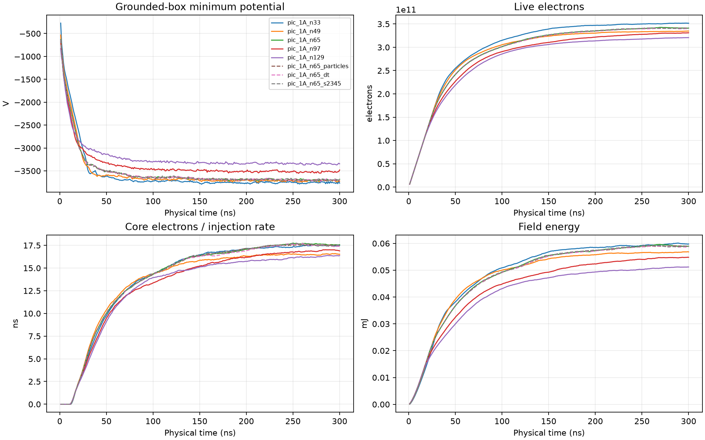
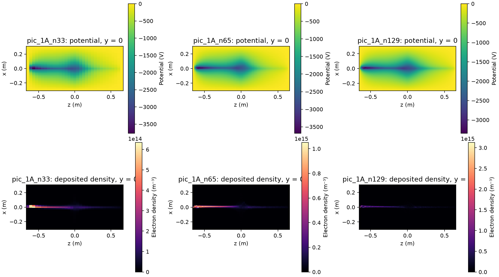

# PIC long window: 300 ns sensitivity study

At 1 A the electron population reaches a quasi-steady state by ~200 ns. In the
200–300 ns window, particle count, timestep and seed each change the window
means by less than 0.6% at 65³. Mesh resolution still changes the minimum
potential by up to 12% and field energy by up to 18%, so the **well depth is not
mesh-converged**. The deepest potential sits near the inlet, not at the center.
This is sensitivity evidence, not a convergence certificate.

## Experiment

Broker job `jonathan-pic-2458a54ed3ff-7fc4f1`, immutable source
`12aac947b4ae6f4b76dcace84e0eee30f61dcff1`, one B200 node, priority 1, automatic
shutdown. Eight CUDA cases ran concurrently, one per GPU.

Common settings: time-dependent electron-only PIC, 1 A external compact gun,
5 keV, 50 µm transverse RMS source, 10° angular spread, gun at
`(0, 0.004, −0.65)` m aimed 30° off +z. Two opposing 30 kA-turn circular
coils of radius 0.5 m (axisymmetric cusp, not a six-coil Polywell). Grounded
rectangular box `±0.3 × ±0.3 × ±0.65` m with absorbing walls; the gun sits on the
`z = −0.65` m face; nominal pitch to local B 29.65°. Core radius 0.125 m. Duration 300 ns; scalar diagnostics every 1 ns.

| Case | Mesh | Timestep | Particles/packet |
|---|---:|---:|---:|
| `n33` … `n129` | 33³, 49³, 65³, 97³, 129³ | 4 ps | 8 per step |
| `n65_particles` | 65³ | 4 ps | 16 per step |
| `n65_dt` | 65³ | 2 ps | 8 every second step |
| `n65_s2345` | 65³, seed 2345 | 4 ps | 8 per step |

Every case injects the same −300 nC. Artifacts:

```text
/public/jonathan/cusp/runs/pic-2458a54ed3ff/attempt-20260913-073830-155476715/
```

Analysis: `src/analyze_pic_window.py`, output in `docs/data/pic-window-12aac94.json`.

## Window means, 200–300 ns

"Residence" is live charge divided by injection rate; it equals mean dwell only
in a stationary state. Loss, entry and exit numbers are final values at 300 ns,
per injected particle, except inlet-face exits, which are a fraction of lost
particles.

| Case | Min potential (V) | Field energy (mJ) | Core residence (ns) | Residence (ns) | Lost | Core entries | ≥2 entries | Inlet-face exits |
|---|---:|---:|---:|---:|---:|---:|---:|---:|
| n33 | −3756 | 59.3 | 17.35 | 56.0 | 81.2% | 0.859 | 18.9% | 64.9% |
| n49 | −3718 | 56.4 | 16.47 | 53.4 | 82.1% | 0.831 | 17.7% | 68.8% |
| n65 | −3693 | 58.7 | 17.52 | 54.4 | 81.8% | 0.839 | 18.4% | 68.9% |
| n97 | −3517 | 53.9 | 16.71 | 52.5 | 82.3% | 0.822 | 17.3% | 65.9% |
| n129 | −3341 | 50.4 | 16.09 | 50.9 | 82.9% | 0.806 | 17.1% | 67.5% |
| n65, 2× particles | −3696 | 58.5 | 17.46 | 54.4 | 81.8% | 0.839 | 18.5% | 68.9% |
| n65, ½ dt | −3694 | 58.5 | 17.43 | 54.3 | 81.9% | 0.837 | 18.4% | 68.9% |
| n65, seed 2345 | −3693 | 58.6 | 17.48 | 54.4 | 81.8% | 0.840 | 18.5% | 68.9% |

Within the window, the relative standard deviation of every tracked mean is
below 1.4% and the largest drift is 4.6% per 100 ns (field energy, 97³), so the
state is close to, but not exactly, stationary.

Relative to 129³:

| Mesh | Min potential deeper by | Field energy higher by | Core electrons higher by |
|---|---:|---:|---:|
| 33³ | 12.4% | 17.6% | 7.9% |
| 49³ | 11.3% | 12.1% | 2.4% |
| 65³ | 10.6% | 16.4% | 8.9% |
| 97³ | 5.3% | 7.1% | 3.9% |

Relative to 65³ seed 1234, the 2× particle, ½ dt and alternate-seed variants
differ by at most 0.37%, 0.51% and 0.26% across the same metrics.



## Fields at 300 ns



| Case | Global minimum position (m) | Center potential (V) |
|---|---|---:|
| n33 | (0, 0, −0.569) | −2775 |
| n65 | (0.009, 0, −0.569) | −2725 |
| n97 | (0.006, 0, −0.582) | −2723 |
| n129 | (0.009, 0, −0.569) | −2629 |

The deepest potential is ~8 cm inside the inlet face, where the injected beam
is densest. A second, shallower negative region surrounds the cusp center. This
is a negative electron potential; it is not a validated positive-ion well, and
no ions are simulated.

## Accounting

Charge balance stayed within 8.3e−19 C (injected charge 3e−7 C) and deposition
error within 5.3e−23 C in every case.

## Interpretation

- Sampling noise and timestep error are not limiting at 65³ over 300 ns.
- Mesh resolution is limiting. The minimum potential converges slowly and
  monotonically shallower with refinement, consistent with an under-resolved
  compact beam near the inlet: the 50 µm source is unresolved on every mesh
  (129³ cells are 4.7 mm × 4.7 mm × 10.2 mm).
- About two thirds of lost particles leave through the inlet face (~55% of
  injected particles); ~18% of injected particles enter the core at least twice.
- The grounded box and its proximity to the inlet likely shape the inlet
  minimum. Box-size sensitivity and credible gun/electrode boundaries are the
  next checks before interpreting well depth.

## Timing

Mean wall time per step under eight concurrent processes was 4.1–4.3 ms at 4 ps
and 3.0 ms for the ½ dt case, which injects every second step. The isolated
single-GPU profile at ~60k live particles measured 2.24 ms per step. The
difference between concurrent long-window and isolated profile timings is being
measured separately (see `docs/pic-cuda-evidence.md`).

## Grounded-box sensitivity (design)

`run_pic_campaign.py --study domain` repeats the 65³ long-window case (1 A,
5 keV, 30 kA-turn, seed 1234, 4 ps, 300 ns, CUDA) in eight grounded boxes.
`--box-half-width`, `--box-bottom` and `--box-top` are in coil radii; node
counts scale so every case keeps the 65³ reference cells (9.4 mm transverse,
20.3 mm axial) and a node at the origin, and the magnetic lookup table is
extended to cover the box. Defaults reproduce the reference mesh and table
bitwise.

| Case | Half-width | Bottom | Top | Nodes |
|---|---:|---:|---:|---|
| `pic_1A_box` | 0.6 | 1.3 | 1.3 | 65×65×65 |
| `pic_1A_box_w0525` | 0.525 | 1.3 | 1.3 | 57×57×65 |
| `pic_1A_box_w045` | 0.45 | 1.3 | 1.3 | 49×49×65 |
| `pic_1A_box_t195` | 0.6 | 1.3 | 1.95 | 65×65×81 |
| `pic_1A_box_t26` | 0.6 | 1.3 | 2.6 | 65×65×97 |
| `pic_1A_box_b1625` | 0.6 | 1.625 | 1.3 | 65×65×73 |
| `pic_1A_box_b195` | 0.6 | 1.95 | 1.3 | 65×65×81 |
| `pic_1A_box_b195_t26` | 0.6 | 1.95 | 2.6 | 65×65×113 |

The gun stays at z = −1.3a with the same aim and local-B angle in every case.
Two geometric constraints shape the matrix:

- Transverse walls only move inward. The coil windings sit at r = a, outside
  the reference box; a wider box would place mesh nodes next to the windings,
  where the sampled field exceeds the 80-steps-per-gyration timestep guard.
- Moving the bottom wall down leaves the gun inside the grounded volume instead
  of on its wall, so the bottom-wall cases change what the gun sees as well as
  the image-charge distance.

`analyze_pic_window.py --study domain` reports window means relative to the
reference box, the final-snapshot potential at the origin, the minimum inside
the core sphere and the global minimum with their positions. This is a
sensitivity check with one seed per box, not a convergence certificate.
