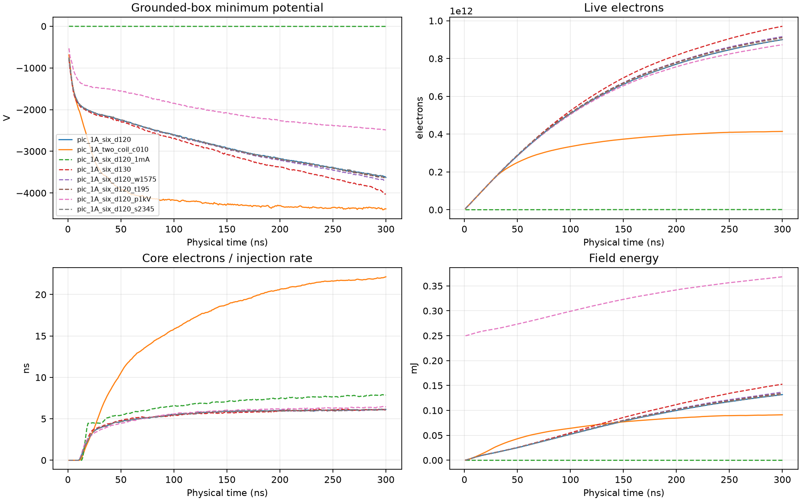
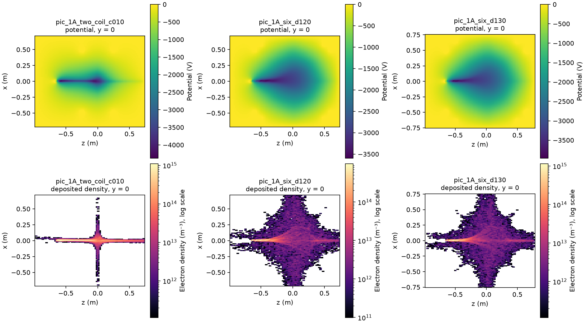

# Six-coil imposed field

`run_transient_pic.py --coils 6` replaces the two-coil axisymmetric cusp with a cube of six
circular coils, one per face (commits `1136c7c`, `d1ee9af`). The default remains `--coils 2`.
This is an imposed vacuum field from fixed coil currents. It is not a validated Polywell
model: there is no plasma current, diamagnetic modification or high-beta feedback, and the
coils are ideal filaments of radius a inside toroidal casings.

## Geometry

- Coils of radius a = 0.5 m sit in the planes x, y, z = ±`--coil-offset`·a. The two coils on
  each axis carry opposite currents, so every coil's on-axis field points to the centre and the
  centre is a null.
- The field is the sum of one single-loop (r, z) table (720 radial points, same elliptic
  integral field as the two-coil table), permuted and translated onto each coil, then sampled
  on a refined mesh excluding the casing interiors.
- Casings are solid tori around each winding (`Torus.axis` = 0, 1, 2), fixed potential,
  absorbing, reported as six conductor-loss channels after the gun barrel.
- Validation requires every casing inside the box on each axis and a gap between adjacent
  casings: windings on neighbouring faces are closest where they approach the shared cube
  edge, at distance √2·(offset − 1)·a between tube centres, which must exceed two casing radii.
  Offsets of 1.0a with any casing and 1.2a with 0.15a casings are rejected.
- The gun stays on the z axis at z = −0.65 m, 30° from +z. It fires through the −z coil
  opening. Local field at the source: 17.6 mT, nominal pitch 30.0° (offset 1.2a) and
  20.7 mT, 30.1° (offset 1.3a), versus 13.6 mT, 29.7° for the two-coil cusp.

## Checks

- Direct single-loop superposition over random interior points: relative error 1.1e-3 from the
  table interpolation.
- Central field below 1e-16 T; 90° rotations about the cube axes and inversion reproduce the
  field to roundoff.
- Every casing has resolved nodes at the test mesh and holds its fixed potential in a short
  reference PIC run.
- `validate_pic_gpu.py` preflight: CUDA field lookup against the reference superposition at
  65,536 seeded box points excluding casings, `rtol=1e-10`. The CPU reference side passes
  (62,721 points, maximum 0.159 T, below the 0.223 T allowed by 80 steps per gyration at 2 ps),
  and the CUDA lookup matched it on a B200 in the campaign preflight (job
  `jonathan-pic-e169c8cb23b9`, source `23e5800`).

## Conductor memory

The electrostatic boundary uses a dense capacitance matrix over all conductor surface nodes,
so storage grows with the square of the node count (8 bytes per entry). At the 65-node
reference cell size:

| Geometry | Conductor nodes | Dense matrix |
|---|---:|---:|
| two coils, 0.15a casings | 30,227 | 7.3 GB |
| two coils, 0.10a casings | 19,595 | 3.1 GB |
| six coils, offset 1.0a, 0.15a casings (overlapping, rejected) | 60,283 | 29.1 GB |
| six coils, offset 1.2a or 1.3a, 0.10a casings | 52,500–52,900 | ~22 GB |

Setup holds the matrix and its Cholesky factor, frees the matrix, then forms the inverse, so the
peak is two to three matrices (44–66 GB with workspace), within a 180 GB B200. Symmetrization is done in 4096-row blocks to avoid a
fourth copy. The two-coil casing campaign built 30k-node matrices in 10–18 s.

## Campaign

`run_pic_campaign.py --study six-coil`: CUDA electron-only PIC, 1 A, 5 keV, 300 ns at 2 ps
with packets of 8 every 2 steps (same injected current per unit time as 4 ps), 65-node
reference cells, 0.06a grounded barrel, lower wall at 1.95a, 0.10a grounded casings.

| Case | Coils | Offset | Box half-width / top | Change |
|---|---:|---:|---|---|
| `pic_1A_two_coil_c010` | 2 | 0.5a | 1.425a / 1.4625a | two-coil control in the same box |
| `pic_1A_six_d120` | 6 | 1.2a | 1.425a / 1.4625a | reference |
| `pic_1A_six_d120_1mA` | 6 | 1.2a | 1.425a / 1.4625a | 1 mA, vacuum-orbit control |
| `pic_1A_six_d130` | 6 | 1.3a | 1.5a / 1.54375a | coil spacing |
| `pic_1A_six_d120_w1575` | 6 | 1.2a | 1.575a / 1.4625a | wider box |
| `pic_1A_six_d120_t195` | 6 | 1.2a | 1.425a / 1.95a | farther top wall |
| `pic_1A_six_d120_p1kV` | 6 | 1.2a | 1.425a / 1.4625a | casings at +1 kV |
| `pic_1A_six_d120_s2345` | 6 | 1.2a | 1.425a / 1.4625a | seed 2345 |

Questions: does the six-coil field turn the beam channel into a more central well, how does
core dwell compare with the two-coil cusp at the same current, and are the box and seed
sensitivities as small as in the two-coil casing study. Results are not evidence about ion
confinement or fusion performance.

## Results (job `jonathan-pic-e169c8cb23b9`, source `23e5800`)

All eight cases exited 0 with `DONE` markers after the passing preflight. Raw output:
`/public/devcontainer-shared/jonathan/cusp/runs/pic-e169c8cb23b9/attempt-20260913-114630-179507303`.
Summary: `docs/data/pic-six-coil-23e5800.json`, from
`analyze_pic_window.py --study six-coil --window-start 2e-7`.

Window means over 200–300 ns ("residence" is live charge over injection rate; the six-coil
runs are not stationary, so it is a population size, not a dwell time). Final values at 300 ns.

| Case | Min φ (V) | Origin φ (V) | Live e⁻ | Live drift /100 ns | Core dwell (ns) | Lost fraction | Box / barrel exits |
|---|---:|---:|---:|---:|---:|---:|---|
| two-coil control | −4354 | −3943 | 4.1e11 | +4% | 21.5 | 0.78 | 37% / 63% |
| six, 1.2a | −3396 | −2896 | 8.4e11 | +15% | 6.0 | 0.52 | 88% / 12% |
| six, 1.2a, 1 mA | −3 | −3 | 8.7e8 | +15% | 7.7 | 0.50 | 85% / 15% |
| six, 1.3a | −3660 | −3090 | 9.0e11 | +17% | 6.1 | 0.48 | 87% / 13% |
| six, wider box | −3453 | −2948 | 8.6e11 | +16% | 6.0 | 0.51 | 88% / 12% |
| six, farther top | −3413 | −2923 | 8.5e11 | +15% | 6.0 | 0.51 | 88% / 12% |
| six, casings +1 kV | −2379 | −2279 | 8.2e11 | +14% | 6.3 | 0.53 | 88% / 12% |
| six, seed 2345 | −3397 | −2885 | 8.4e11 | +15% | 6.0 | 0.52 | 88% / 12% |

No electron reached a casing in any case. Charge balance stayed below 4e-19 C. Steps took
8.4 ms (six-coil) versus 3.7 ms (two-coil), from the larger live population; conductor setup
took 30 s.

Observations:

- **The six-coil field fills the cube.** The two-coil electrons stay on the axis and leak
  through the ring cusp at z = 0 and the far axial cusp (72% of box exits through +z; the
  barrel collects 63% of all exits). The six-coil electrons spread over the cube interior with
  lanes towards each face; box exits split 15–24% across the five faces away from the gun.
  The potential is a broad, roughly spherical depression around the centre plus the gun
  channel, instead of the two-coil axial channel.
- **It holds more charge but has not saturated.** The six-coil runs hold twice the two-coil
  population at 300 ns and it is still growing 15% per 100 ns, with the minimum potential
  still deepening 13% per 100 ns. The shallower six-coil well at 300 ns is not a steady-state
  comparison; the two-coil run is close to saturated.
- **At 300 ns retention is set by single-particle orbits.** The 1 mA control loses the same
  fraction (0.50 versus 0.52). Space charge at 1 A shortens core dwell from 7.7 to 6.0 ns.
  Core dwell is shorter than the two-coil value because electrons spend their time spread over
  the cube, not concentrated near the axis.
- **Box and seed are not the limiting factor.** Wider box, farther top wall and the second
  seed change every window mean by ≤1.7%. Moving the coils to 1.3a deepens the well 8% and
  holds 7% more electrons. Casings at +1 kV give a 30% shallower well, 9% more core entries
  per injected electron and 3% fewer live electrons.

What this does not establish: a saturated or converged well (only 300 ns, one mesh), ion
confinement (electron-only; the two-coil coupled campaign neutralized in ~147 µs at 1e-3 Pa),
or anything about plasma magnetic feedback. The field is an imposed vacuum field in a
grounded box.

## Saturation follow-up (job `jonathan-pic-1baf1e989ae7`, source `d88f4cf`)

`run_pic_campaign.py --study six-coil-long`: the reference geometry (1.2a, 0.10a casings,
same box) for 1 µs at 2 ps, to see whether the population, potential and losses level off.
Cases: 1 A with seeds 1234 and 2345, 1 mA control, 0.3 A and 3 A current scaling, casings at
−1 kV, and 60 kA-turn coils at 1 ps with packets every 4 steps (same injected current per
unit time) for 600 ns, at 1 A and 1 mA. 16 snapshots per case, 6 h per-case timeout.

